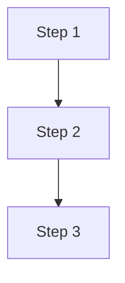

# No ASCII Diagrams

**NEVER create ASCII art diagrams using box-drawing characters (┌ ┐ └ ┘ │ ─ ├ ┤ ┬ ┴ ┼ ▼ ▲ etc.).**

Always use one of these alternatives instead:

| Need | Solution |
|------|----------|
| Flow diagrams | Mermaid `flowchart TD` or `flowchart LR` |
| Sequence diagrams | Mermaid `sequenceDiagram` |
| Architecture diagrams | Mermaid C4 or PlantUML |
| Timelines | Mermaid `gantt` |
| State machines | Mermaid `stateDiagram-v2` |
| Simple relationships | Markdown tables |
| Class hierarchies | Mermaid `classDiagram` |

## Why

- ASCII diagrams break when fonts change, terminals resize, or markdown renderers differ
- Mermaid diagrams render natively on GitHub, GitLab, Obsidian, and most documentation platforms
- Mermaid diagrams are searchable, accessible, and version-control friendly
- Box-drawing characters cause encoding issues across platforms

## Format

Always use fenced code blocks with the `mermaid` language identifier:

````markdown

````

This rule applies to all files in this repository: README, docs, skills, and examples.
