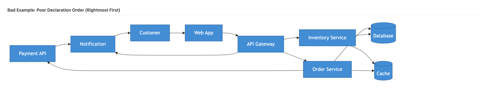
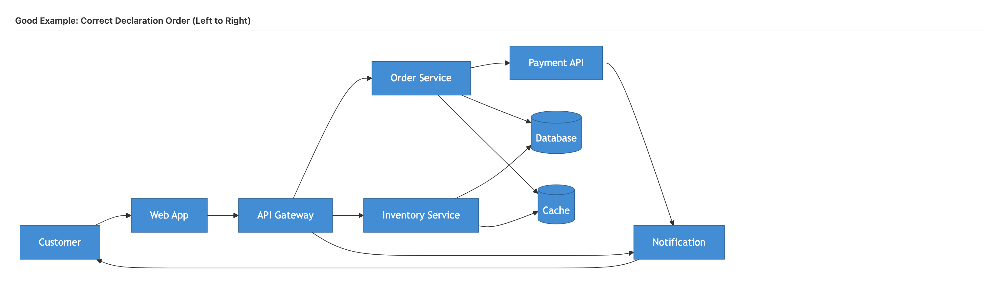
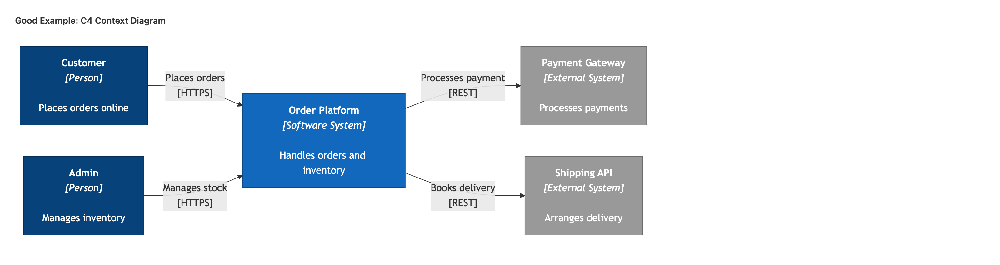
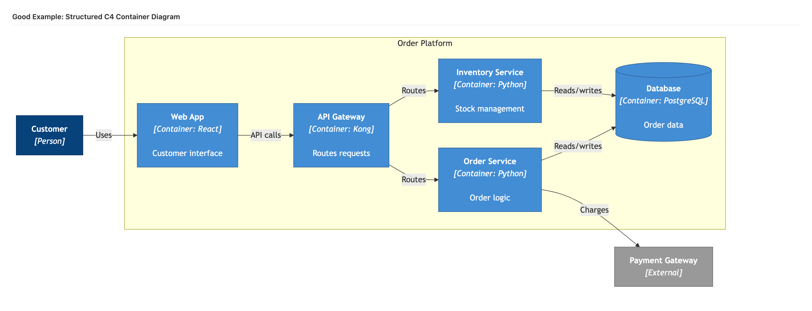
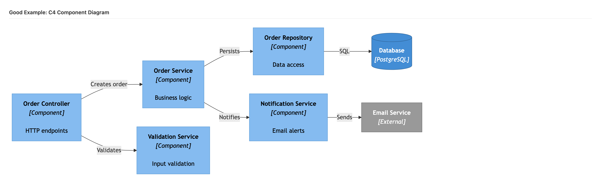
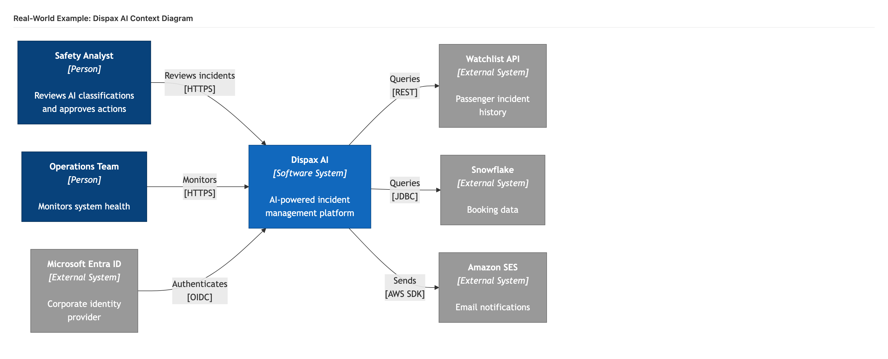

# Dave's Claude Code Skills

A curated collection of [Claude Code](https://claude.ai/code) skills for software architecture, knowledge management, and engineering. Drop these `.md` files into your `.claude/skills/` directory and invoke them as slash commands.

**37 skills** across **8 categories**. **17 skills** use **agent teams** — parallel sub-agents launched via the Task tool that analyse different dimensions simultaneously, process batches at scale, or triage before deep-diving. The result: faster execution, more thorough analysis, and lower cost per insight.

---

## Skills Overview

| Category | Skills | Agent Teams | Focus |
|----------|--------|-------------|-------|
| [Architecture](#architecture-8-skills) | 8 | 5 | Decisions, impact analysis, NFRs, cost optimisation |
| [Content Processing](#content-processing-8-skills) | 8 | 2 | PDFs, PowerPoint, YouTube, web pages, books |
| [Diagramming](#diagramming-3-skills) | 3 | 1 | C4 diagrams, system landscapes, diagram review |
| [Vault Health](#vault-health-6-skills) | 6 | 6 | Quality reports, broken links, orphans, auto-tagging |
| [Scoring](#scoring-2-skills) | 2 | 1 | Document scoring, executive summaries |
| [Reporting](#reporting-2-skills) | 2 | 2 | Weekly summaries, project status reports |
| [Meetings](#meetings-3-skills) | 3 | 1 | Meeting notes, voice transcripts, email capture |
| [Knowledge](#knowledge-5-skills) | 5 | 0 | Summarisation, related content, decisions, timelines |
| **Total** | **37** | **17** | |

---

## Architecture (8 skills)

Skills for documenting decisions, analysing change impact, comparing scenarios, and managing non-functional requirements. Five of eight skills use agent teams for multi-dimensional parallel analysis.

| Skill | Command | Agents | Description |
|-------|---------|--------|-------------|
| [ADR](skills/architecture/adr.md) | `/adr` | — | Create Architecture Decision Records with structured context, rationale, and consequences |
| [Impact Analysis](skills/architecture/impact-analysis.md) | `/impact-analysis` | 4 | Analyse cascading impact across technical, organisational, financial, and risk dimensions |
| [Scenario Compare](skills/architecture/scenario-compare.md) | `/scenario-compare` | 3 | Compare 2-4 architectural scenarios with cost, timeline, complexity, and risk analysis |
| [NFR Capture](skills/architecture/nfr-capture.md) | `/nfr-capture` | — | Capture non-functional requirements with measurable acceptance criteria (ISO 25010) |
| [NFR Review](skills/architecture/nfr-review.md) | `/nfr-review` | 3 | Review NFRs for completeness, measurability, and feasibility |
| [Architecture Report](skills/architecture/architecture-report.md) | `/architecture-report` | 5 | Generate comprehensive reports for governance, audit, and stakeholder communication |
| [Cost Analysis](skills/architecture/cost-analysis.md) | `/cost-analysis` | 3 | Analyse infrastructure, licensing, and operational costs; identify savings opportunities |
| [Dependency Graph](skills/architecture/dependency-graph.md) | `/dependency-graph` | — | Visualise system dependencies with colour-coded criticality in Mermaid |

## Content Processing (8 skills)

Skills for extracting and structuring content from PDFs, presentations, videos, web pages, articles, and books. Captures external knowledge into searchable Markdown notes.

| Skill | Command | Agents | Description |
|-------|---------|--------|-------------|
| [PDF Extract](skills/content-processing/pdf-extract.md) | `/pdf-extract` | — | Extract structured content from PDFs preserving headings, tables, and formatting |
| [PPTX Extract](skills/content-processing/pptx-extract.md) | `/pptx-extract` | — | Convert PowerPoint slides to structured Markdown with speaker notes |
| [YouTube Analyze](skills/content-processing/youtube-analyze.md) | `/youtube-analyze` | — | Analyse videos via transcripts with timestamped summaries and key takeaways |
| [Video Digest](skills/content-processing/video-digest.md) | `/video-digest` | N | Batch-triage videos by relevance (Haiku), then deeply process the best (Sonnet) |
| [Weblink](skills/content-processing/weblink.md) | `/weblink` | — | Quick web page capture with AI-generated summary |
| [Article](skills/content-processing/article.md) | `/article` | — | Quick article capture with summary, key quotes, and relevance scoring |
| [Book Notes](skills/content-processing/book-notes.md) | `/book-notes` | 3 | Create book notes with parallel extraction of concepts, frameworks, and actions |
| [Document Extract](skills/content-processing/document-extract.md) | `/document-extract` | — | Extract from any format (PDF, DOCX, HTML, CSV) with auto-detection |

## Diagramming (3 skills)

Skills for generating and reviewing architecture diagrams. Built on graph drawing research (Purchase et al.) and real-world C4 modelling experience. See the [blog post](docs/blog-post.md) for the theory.

| Skill | Command | Agents | Description |
|-------|---------|--------|-------------|
| [Diagram](skills/diagramming/diagram.md) | `/diagram` | — | Generate architecture diagrams in multiple formats (C4, system landscape, data flow, AWS) |
| [C4 Diagram](skills/diagramming/c4-diagram.md) | `/c4-diagram` | — | Specialised C4 generation: Mermaid C4, flowchart LR with C4 styling, or PlantUML |
| [Diagram Review](skills/diagramming/diagram-review.md) | `/diagram-review` | 4 | Analyse existing diagrams for readability and architecture quality |

## Vault Health (6 skills)

Skills for measuring and improving the quality of a Markdown knowledge vault. All six use agent teams — fan-out for multi-dimensional analysis, batch for high-throughput processing.

| Skill | Command | Agents | Description |
|-------|---------|--------|-------------|
| [Quality Report](skills/vault-health/quality-report.md) | `/quality-report` | 5 | Comprehensive quality metrics: readability, links, metadata, structure, freshness |
| [Broken Links](skills/vault-health/broken-links.md) | `/broken-links` | 3 | Find broken wiki-links, heading anchors, and missing attachment references |
| [Orphan Finder](skills/vault-health/orphan-finder.md) | `/orphan-finder` | 4 | Detect disconnected notes and suggest meaningful connections |
| [Auto-Tag](skills/vault-health/auto-tag.md) | `/auto-tag` | N | Batch auto-tag notes with hierarchical tags from content analysis |
| [Auto-Summary](skills/vault-health/auto-summary.md) | `/auto-summary` | N | Batch-generate one-line `summary` fields for notes missing them |
| [Link Checker](skills/vault-health/link-checker.md) | `/link-checker` | N | Validate external HTTP/HTTPS URLs for dead links, redirects, and timeouts |

## Scoring (2 skills)

Skills for evaluating documents against rubrics and generating stakeholder-ready summaries.

| Skill | Command | Agents | Description |
|-------|---------|--------|-------------|
| [Score Document](skills/scoring/score-document.md) | `/score-document` | 4 | Score documents against customisable rubrics (0-3, 0-5, or 0-10) with evidence |
| [Exec Summary](skills/scoring/exec-summary.md) | `/exec-summary` | — | Generate executive summaries tailored to CEO, CTO, board, or PM audiences |

## Reporting (2 skills)

Skills for generating periodic status reports by analysing vault content across multiple dimensions in parallel.

| Skill | Command | Agents | Description |
|-------|---------|--------|-------------|
| [Weekly Summary](skills/reporting/weekly-summary.md) | `/weekly-summary` | 5 | Generate weekly activity reports from daily notes, tasks, meetings, and projects |
| [Project Report](skills/reporting/project-report.md) | `/project-report` | 4 | Generate RAG project status reports with tasks, risks, and timeline assessment |

## Meetings (3 skills)

Skills for capturing and structuring meeting content from transcripts, voice recordings, and emails.

| Skill | Command | Agents | Description |
|-------|---------|--------|-------------|
| [Meeting Notes](skills/meetings/meeting-notes.md) | `/meeting-notes` | 3 | Create structured meeting notes with decision and action item extraction |
| [Voice Meeting](skills/meetings/voice-meeting.md) | `/voice-meeting` | — | Process voice transcripts with speech-to-text correction into structured notes |
| [Email Capture](skills/meetings/email-capture.md) | `/email-capture` | — | Capture important emails as structured vault notes with action items |

## Knowledge (5 skills)

Skills for discovering, connecting, and visualising knowledge across a vault.

| Skill | Command | Agents | Description |
|-------|---------|--------|-------------|
| [Summarize](skills/knowledge/summarize.md) | `/summarize` | — | Summarise notes with configurable depth (one-liner, paragraph, page) and audience |
| [Find Related](skills/knowledge/find-related.md) | `/find-related` | — | Discover related content via tag overlap, backlinks, keywords, and temporal proximity |
| [Find Decisions](skills/knowledge/find-decisions.md) | `/find-decisions` | — | Extract and catalogue formal and informal decisions across a date range |
| [Timeline](skills/knowledge/timeline.md) | `/timeline` | — | Generate visual timelines (Mermaid Gantt, table, or list) from vault events |
| [Skill Creator](skills/knowledge/skill-creator.md) | `/skill-creator` | — | Generate new Claude Code skill files with agent team boilerplate |

---

## How Agent Teams Work

17 of the 37 skills use **agent teams** — parallel sub-agents launched via Claude Code's `Task` tool. Each agent runs independently in its own context window, analyses one dimension of the problem, and returns structured results. The coordinator synthesises everything into a unified output.

```
                         ┌─────────────────┐
                         │  User invokes    │
                         │  /skill          │
                         └────────┬────────┘
                                  │
                         ┌────────▼────────┐
                         │  COORDINATOR     │
                         │  Gathers input,  │
                         │  prepares agent  │
                         │  prompts         │
                         └────────┬────────┘
                                  │
            ┌─────────────────────┼─────────────────────┐
            │                     │                     │
 ┌──────────▼──────────┐ ┌───────▼───────┐ ┌───────────▼─────────┐
 │  Agent 1 (Sonnet)    │ │  Agent 2      │ │  Agent N            │
 │  Dimension A         │ │  Dimension B  │ │  Dimension N        │
 │  e.g. Technical      │ │  e.g. Cost    │ │  e.g. Risk          │
 │                      │ │               │ │                     │
 │  Returns: structured │ │  Returns: data│ │  Returns: data      │
 └──────────┬──────────┘ └───────┬───────┘ └───────────┬─────────┘
            │                     │                     │
            └─────────────────────┼─────────────────────┘
                                  │
                         ┌────────▼────────┐
                         │  COORDINATOR     │
                         │  Synthesises all │
                         │  agent results   │
                         │  into unified    │
                         │  output          │
                         └─────────────────┘
```

### Three Orchestration Patterns

| Pattern | How It Works | Example Skill | Typical Speedup |
|---------|-------------|---------------|-----------------|
| **Fan-Out/Fan-In** | 3-5 agents analyse different dimensions of the same input in parallel; coordinator synthesises | `/impact-analysis` (technical, org, financial, risk) | 3-4× |
| **Batch Processing** | Same operation on many items, divided into parallel batches of 15-20 | `/auto-tag` (N Haiku agents tag notes in parallel) | 4-9× |
| **Triage + Selective** | Fast agents score everything; only high-scoring items get deep processing | `/video-digest` (Haiku triages, Sonnet deep-analyses) | 2-3× time, 60-80% cost saving |

For the full explanation with worked examples, anti-patterns, and model selection guidance, see the **[Agent Teams Guide](docs/agent-teams-guide.md)**.

---

## Examples

Worked examples with prompts, outputs, and explanations of what makes each diagram good (or bad).

### Diagramming Examples

| Example | What It Shows |
|---------|---------------|
| [Declaration Order](examples/diagramming/01-declaration-order.md) | Why element declaration order is the single most important factor for diagram readability. Side-by-side comparison of the same 9 elements in random vs. structured order. |
| [C4 Context Diagram](examples/diagramming/02-c4-context-diagram.md) | How to create a clean Level 1 C4 diagram showing actors, system boundary, and external dependencies. |
| [C4 Container Diagram](examples/diagramming/03-c4-container-diagram.md) | How to create a Level 2 C4 diagram with system boundaries, technology labels, and database shapes. Includes PlantUML alternative. |
| [C4 Component Diagram](examples/diagramming/04-c4-component-diagram.md) | How to diagram internal components (controllers, services, repositories) at C4 Level 3. |
| [Real-World Example](examples/diagramming/05-real-world-example.md) | Complete Context + Container diagrams for a real AI-powered incident management platform. |

### Example Screenshots

All examples include rendered diagram screenshots:

| | | |
|---|---|---|
|  |  |  |
| Bad declaration order | Good declaration order | C4 Context |
|  |  |  |
| C4 Container | C4 Component | Real-world Context |

---

## Installation

### All Skills

```bash
mkdir -p .claude/skills
cp skills/**/*.md .claude/skills/
```

### By Category

```bash
# Architecture — ADRs, impact analysis, NFRs, cost analysis
cp skills/architecture/*.md .claude/skills/

# Content Processing — PDF, PPTX, YouTube, web, books
cp skills/content-processing/*.md .claude/skills/

# Diagramming — C4 diagrams, system landscapes, diagram review
cp skills/diagramming/*.md .claude/skills/

# Vault Health — quality reports, broken links, orphans, auto-tag
cp skills/vault-health/*.md .claude/skills/

# Scoring — document scoring, executive summaries
cp skills/scoring/*.md .claude/skills/

# Reporting — weekly summaries, project status reports
cp skills/reporting/*.md .claude/skills/

# Meetings — meeting notes, voice transcripts, email capture
cp skills/meetings/*.md .claude/skills/

# Knowledge — summarise, find related, decisions, timelines
cp skills/knowledge/*.md .claude/skills/
```

### Individual Skills

```bash
# Pick only the skills you need
cp skills/architecture/adr.md .claude/skills/
cp skills/vault-health/quality-report.md .claude/skills/
cp skills/content-processing/youtube-analyze.md .claude/skills/
```

### Verify Installation

After copying, invoke any skill in Claude Code:

```
/adr Use Event-Driven Integration for Orders
/impact-analysis Migrate database from Oracle to PostgreSQL
/quality-report --type ADR
/weekly-summary
/youtube-analyze https://www.youtube.com/watch?v=example
```

---

## Documentation

| Document | Description |
|----------|-------------|
| [Agent Teams Guide](docs/agent-teams-guide.md) | How agent teams work: patterns, model selection, best practices, anti-patterns, worked example |
| [Skills Reference](docs/skills-reference.md) | Quick-reference card: all skills by category, installation commands, model cost guide |
| [Blog Post](docs/blog-post.md) | Why Your AI-Generated Diagrams Look Terrible — the graph drawing research behind the diagramming skills |

---

## Key Concepts

### Diagramming

Built on three insights from graph drawing research:

- **Declaration order controls layout.** Dagre (Mermaid) and Sugiyama (PlantUML) position elements based on where they appear in the source. Declare elements in reading order — actors left, data stores right.
- **Edge crossings are the strongest predictor of comprehension difficulty.** Research by Helen Purchase showed reducing crossings improves reader accuracy by 30-40%. Always set an explicit crossing target.
- **Gestalt proximity overrides colour.** Elements placed close together are perceived as related, regardless of styling. Use subgraphs and boundaries to group related components.

### Agent Teams

Built on three orchestration principles:

- **Fan-Out/Fan-In for multi-dimensional analysis.** When evaluating something from multiple angles (technical, financial, risk), run agents in parallel and synthesise. Used by 13 skills.
- **Batch Processing for scale.** When the same operation applies to many items, divide into batches and process in parallel with cost-effective Haiku agents. Used by 3 skills.
- **Triage before deep processing.** When only some items are worth deep analysis, use fast agents to score first, then invest in expensive processing only for high-value items. Used by 1 skill.

---

## Contributing

Contributions welcome. To add a new skill:

1. Create a `.md` file in the appropriate `skills/<category>/` directory
2. Include YAML frontmatter with `description` and `model` fields
3. Follow the skill template: When to Use, Usage, Instructions, Output Format, Examples
4. For agent team skills, define each agent with name, model, task, steps, and return format
5. Use the [`/skill-creator`](skills/knowledge/skill-creator.md) skill to generate boilerplate
6. Add a worked example in `examples/<category>/`
7. Update this README

See the [Agent Teams Guide](docs/agent-teams-guide.md) for patterns and best practices when building agent team skills.

---

## Licence

MIT
