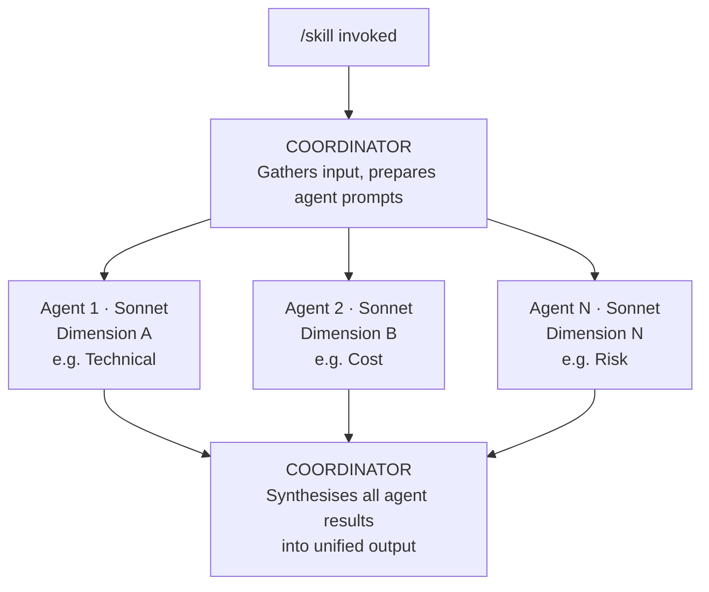

# Dave's Claude Code Skills

A curated collection of [Claude Code](https://claude.ai/code) skills and hooks for software architecture, knowledge management, and engineering. Drop `.md` files into `.claude/skills/` for slash commands, or `.py`/`.sh` scripts into your hooks directory for automated guardrails.

**37 skills** across **8 categories**. **17 skills** use **agent teams** — parallel sub-agents launched via the Task tool that analyse different dimensions simultaneously, process batches at scale, or triage before deep-diving. **12 hooks** across **5 categories** provide automated security, quality, and UX guardrails.

---

## Skills Overview

| Category | Skills | Agent Teams | Focus |
|----------|--------|-------------|-------|
| [Architecture](#architecture-8-skills) | 8 | 5 | Decisions, impact analysis, NFRs, cost optimisation |
| [Content Processing](#content-processing-8-skills) | 8 | 2 | PDFs, PowerPoint, YouTube, web pages, books |
| [Diagramming](#diagramming-3-skills) | 3 | 1 | C4 diagrams, system landscapes, diagram review |
| [Vault Health](#vault-health-6-skills) | 6 | 6 | Quality reports, broken links, orphans, auto-tagging |
| [Scoring](#scoring-2-skills) | 2 | 1 | Document scoring, executive summaries |
| [Reporting](#reporting-2-skills) | 2 | 2 | Weekly summaries, project status reports |
| [Meetings](#meetings-3-skills) | 3 | 1 | Meeting notes, voice transcripts, email capture |
| [Knowledge](#knowledge-5-skills) | 5 | 0 | Summarisation, related content, decisions, timelines |
| **Total** | **37** | **17** | |
| [**Hooks**](#hooks-12-hooks) | **12** | — | Security, quality, UX, safety, notifications |

---

## Architecture (8 skills)

Skills for documenting decisions, analysing change impact, comparing scenarios, and managing non-functional requirements. Five of eight skills use agent teams for multi-dimensional parallel analysis.

| Skill | Command | Agents | Description |
|-------|---------|--------|-------------|
| [ADR](skills/architecture/adr.md) | `/adr` | — | Create Architecture Decision Records with structured context, rationale, and consequences |
| [Impact Analysis](skills/architecture/impact-analysis.md) | `/impact-analysis` | 4 | Analyse cascading impact across technical, organisational, financial, and risk dimensions |
| [Scenario Compare](skills/architecture/scenario-compare.md) | `/scenario-compare` | 3 | Compare 2-4 architectural scenarios with cost, timeline, complexity, and risk analysis |
| [NFR Capture](skills/architecture/nfr-capture.md) | `/nfr-capture` | — | Capture non-functional requirements with measurable acceptance criteria (ISO 25010) |
| [NFR Review](skills/architecture/nfr-review.md) | `/nfr-review` | 3 | Review NFRs for completeness, measurability, and feasibility |
| [Architecture Report](skills/architecture/architecture-report.md) | `/architecture-report` | 5 | Generate comprehensive reports for governance, audit, and stakeholder communication |
| [Cost Analysis](skills/architecture/cost-analysis.md) | `/cost-analysis` | 3 | Analyse infrastructure, licensing, and operational costs; identify savings opportunities |
| [Dependency Graph](skills/architecture/dependency-graph.md) | `/dependency-graph` | — | Visualise system dependencies with colour-coded criticality in Mermaid |

## Content Processing (8 skills)

Skills for extracting and structuring content from PDFs, presentations, videos, web pages, articles, and books. Captures external knowledge into searchable Markdown notes.

| Skill | Command | Agents | Description |
|-------|---------|--------|-------------|
| [PDF Extract](skills/content-processing/pdf-extract.md) | `/pdf-extract` | — | Extract structured content from PDFs with optional [docling](https://github.com/docling-project/docling) support for native table recognition |
| [PPTX Extract](skills/content-processing/pptx-extract.md) | `/pptx-extract` | — | Convert PowerPoint slides to Markdown with docling/python-pptx dual extraction and Visual Mode |
| [YouTube Analyze](skills/content-processing/youtube-analyze.md) | `/youtube-analyze` | — | Analyse videos via transcripts with timestamped summaries and key takeaways |
| [Video Digest](skills/content-processing/video-digest.md) | `/video-digest` | N | Batch-triage videos by relevance (Haiku), then deeply process the best (Sonnet) |
| [Weblink](skills/content-processing/weblink.md) | `/weblink` | — | Quick web page capture with AI-generated summary |
| [Article](skills/content-processing/article.md) | `/article` | — | Quick article capture with summary, key quotes, and relevance scoring |
| [Book Notes](skills/content-processing/book-notes.md) | `/book-notes` | 3 | Create book notes with parallel extraction and optional knowledge compounding via spawned Concept/Pattern/Theme notes |
| [Document Extract](skills/content-processing/document-extract.md) | `/document-extract` | — | Extract from any format (PDF, DOCX, HTML, CSV) with auto-detection |

## Diagramming (3 skills)

Skills for generating and reviewing architecture diagrams. Built on graph drawing research (Purchase et al.) and real-world C4 modelling experience. See the [blog post](docs/blog-post.md) for the theory.

| Skill | Command | Agents | Description |
|-------|---------|--------|-------------|
| [Diagram](skills/diagramming/diagram.md) | `/diagram` | — | Generate architecture diagrams in multiple formats (C4, system landscape, data flow, AWS) |
| [C4 Diagram](skills/diagramming/c4-diagram.md) | `/c4-diagram` | — | Specialised C4 generation: Mermaid C4, flowchart LR with C4 styling, or PlantUML |
| [Diagram Review](skills/diagramming/diagram-review.md) | `/diagram-review` | 4 | Analyse existing diagrams for readability and architecture quality |

## Vault Health (6 skills)

Skills for measuring and improving the quality of a Markdown knowledge vault. All six use agent teams — fan-out for multi-dimensional analysis, batch for high-throughput processing.

| Skill | Command | Agents | Description |
|-------|---------|--------|-------------|
| [Quality Report](skills/vault-health/quality-report.md) | `/quality-report` | 5 | Comprehensive quality metrics with Flesch readability formulas, link density scoring, and type-aware freshness thresholds |
| [Broken Links](skills/vault-health/broken-links.md) | `/broken-links` | 3 | Find broken wiki-links, heading anchors, and missing attachment references |
| [Orphan Finder](skills/vault-health/orphan-finder.md) | `/orphan-finder` | 4 | Detect disconnected notes and suggest meaningful connections |
| [Auto-Tag](skills/vault-health/auto-tag.md) | `/auto-tag` | N | Batch auto-tag notes using type-based rules and customisable keyword-to-tag mapping tables |
| [Auto-Summary](skills/vault-health/auto-summary.md) | `/auto-summary` | N | Batch-generate one-line `summary` fields with type-specific patterns and quality validation rules |
| [Link Checker](skills/vault-health/link-checker.md) | `/link-checker` | N | Validate external URLs with curl-based checking, frontmatter status tracking, and cross-reference verification |

## Scoring (2 skills)

Skills for evaluating documents against rubrics and generating stakeholder-ready summaries.

| Skill | Command | Agents | Description |
|-------|---------|--------|-------------|
| [Score Document](skills/scoring/score-document.md) | `/score-document` | 4 | Score documents against customisable rubrics with optional SQLite persistence for querying and multi-scorer comparison |
| [Exec Summary](skills/scoring/exec-summary.md) | `/exec-summary` | — | Generate executive summaries tailored to CEO, CTO, board, or PM audiences |

## Reporting (2 skills)

Skills for generating periodic status reports by analysing vault content across multiple dimensions in parallel.

| Skill | Command | Agents | Description |
|-------|---------|--------|-------------|
| [Weekly Summary](skills/reporting/weekly-summary.md) | `/weekly-summary` | 5 | Generate weekly activity reports from daily notes, tasks, meetings, and projects |
| [Project Report](skills/reporting/project-report.md) | `/project-report` | 4 | Generate RAG project status reports with tasks, risks, and timeline assessment |

## Meetings (3 skills)

Skills for capturing and structuring meeting content from transcripts, voice recordings, and emails.

| Skill | Command | Agents | Description |
|-------|---------|--------|-------------|
| [Meeting Notes](skills/meetings/meeting-notes.md) | `/meeting-notes` | 3 | Create structured meeting notes with decision and action item extraction |
| [Voice Meeting](skills/meetings/voice-meeting.md) | `/voice-meeting` | — | Process voice transcripts with speech-to-text correction into structured notes |
| [Email Capture](skills/meetings/email-capture.md) | `/email-capture` | — | Capture important emails as structured vault notes with action items |

## Knowledge (5 skills)

Skills for discovering, connecting, and visualising knowledge across a vault.

| Skill | Command | Agents | Description |
|-------|---------|--------|-------------|
| [Summarize](skills/knowledge/summarize.md) | `/summarize` | — | Summarise notes with configurable depth (one-liner, paragraph, page) and audience |
| [Find Related](skills/knowledge/find-related.md) | `/find-related` | — | Discover related content via tag overlap, backlinks, keywords, and temporal proximity |
| [Find Decisions](skills/knowledge/find-decisions.md) | `/find-decisions` | — | Extract and catalogue formal and informal decisions across a date range |
| [Timeline](skills/knowledge/timeline.md) | `/timeline` | — | Generate visual timelines (Mermaid Gantt, table, or list) from vault events |
| [Skill Creator](skills/knowledge/skill-creator.md) | `/skill-creator` | — | Generate new Claude Code skill files with agent team boilerplate |

---

## How Agent Teams Work

17 of the 37 skills use **agent teams** — parallel sub-agents launched via Claude Code's `Task` tool. Each agent runs independently in its own context window, analyses one dimension of the problem, and returns structured results. The coordinator synthesises everything into a unified output.



### Three Orchestration Patterns

| Pattern | How It Works | Example Skill | Typical Speedup |
|---------|-------------|---------------|-----------------|
| **Fan-Out/Fan-In** | 3-5 agents analyse different dimensions of the same input in parallel; coordinator synthesises | `/impact-analysis` (technical, org, financial, risk) | 3-4× |
| **Batch Processing** | Same operation on many items, divided into parallel batches of 15-20 | `/auto-tag` (N Haiku agents tag notes in parallel) | 4-9× |
| **Triage + Selective** | Fast agents score everything; only high-scoring items get deep processing | `/video-digest` (Haiku triages, Sonnet deep-analyses) | 2-3× time, 60-80% cost saving |

For the full explanation with worked examples, anti-patterns, and model selection guidance, see the **[Agent Teams Guide](docs/agent-teams-guide.md)**.

---

## Examples

Worked examples with prompts, outputs, and explanations of what makes each diagram good (or bad).

### Diagramming Examples

| Example | What It Shows |
|---------|---------------|
| [Declaration Order](examples/diagramming/01-declaration-order.md) | Why element declaration order is the single most important factor for diagram readability. Side-by-side comparison of the same 9 elements in random vs. structured order. |
| [C4 Context Diagram](examples/diagramming/02-c4-context-diagram.md) | How to create a clean Level 1 C4 diagram showing actors, system boundary, and external dependencies. |
| [C4 Container Diagram](examples/diagramming/03-c4-container-diagram.md) | How to create a Level 2 C4 diagram with system boundaries, technology labels, and database shapes. Includes PlantUML alternative. |
| [C4 Component Diagram](examples/diagramming/04-c4-component-diagram.md) | How to diagram internal components (controllers, services, repositories) at C4 Level 3. |
| [Real-World Example](examples/diagramming/05-real-world-example.md) | Complete Context + Container diagrams for a real AI-powered incident management platform. |

### Example Screenshots

All examples include rendered diagram screenshots:

| | | |
|---|---|---|
|  |  |  |
| Bad declaration order | Good declaration order | C4 Context |
|  |  |  |
| C4 Container | C4 Component | Real-world Context |

---

## Installation

### All Skills

```bash
mkdir -p .claude/skills
cp skills/**/*.md .claude/skills/
```

### By Category

```bash
# Architecture — ADRs, impact analysis, NFRs, cost analysis
cp skills/architecture/*.md .claude/skills/

# Content Processing — PDF, PPTX, YouTube, web, books
cp skills/content-processing/*.md .claude/skills/

# Diagramming — C4 diagrams, system landscapes, diagram review
cp skills/diagramming/*.md .claude/skills/

# Vault Health — quality reports, broken links, orphans, auto-tag
cp skills/vault-health/*.md .claude/skills/

# Scoring — document scoring, executive summaries
cp skills/scoring/*.md .claude/skills/

# Reporting — weekly summaries, project status reports
cp skills/reporting/*.md .claude/skills/

# Meetings — meeting notes, voice transcripts, email capture
cp skills/meetings/*.md .claude/skills/

# Knowledge — summarise, find related, decisions, timelines
cp skills/knowledge/*.md .claude/skills/
```

### Individual Skills

```bash
# Pick only the skills you need
cp skills/architecture/adr.md .claude/skills/
cp skills/vault-health/quality-report.md .claude/skills/
cp skills/content-processing/youtube-analyze.md .claude/skills/
```

### Verify Installation

After copying, invoke any skill in Claude Code:

```
/adr Use Event-Driven Integration for Orders
/impact-analysis Migrate database from Oracle to PostgreSQL
/quality-report --type ADR
/weekly-summary
/youtube-analyze https://www.youtube.com/watch?v=example
```

---

## Documentation

| Document | Description |
|----------|-------------|
| [Agent Teams Guide](docs/agent-teams-guide.md) | How agent teams work: patterns, model selection, best practices, anti-patterns, worked example |
| [Skills Reference](docs/skills-reference.md) | Quick-reference card: all skills by category, installation commands, model cost guide |
| [Blog Post](docs/blog-post.md) | Why Your AI-Generated Diagrams Look Terrible — the graph drawing research behind the diagramming skills |
| [Hooks Guide](docs/hooks/README.md) | Complete hooks documentation: lifecycle events, patterns, configuration, installation |

---

## Key Concepts

### Diagramming

Built on three insights from graph drawing research:

- **Declaration order controls layout.** Dagre (Mermaid) and Sugiyama (PlantUML) position elements based on where they appear in the source. Declare elements in reading order — actors left, data stores right.
- **Edge crossings are the strongest predictor of comprehension difficulty.** Research by Helen Purchase showed reducing crossings improves reader accuracy by 30-40%. Always set an explicit crossing target.
- **Gestalt proximity overrides colour.** Elements placed close together are perceived as related, regardless of styling. Use subgraphs and boundaries to group related components.

### Agent Teams

Built on three orchestration principles:

- **Fan-Out/Fan-In for multi-dimensional analysis.** When evaluating something from multiple angles (technical, financial, risk), run agents in parallel and synthesise. Used by 13 skills.
- **Batch Processing for scale.** When the same operation applies to many items, divide into batches and process in parallel with cost-effective Haiku agents. Used by 3 skills.
- **Triage before deep processing.** When only some items are worth deep analysis, use fast agents to score first, then invest in expensive processing only for high-value items. Used by 1 skill.

---

## Hooks (12 hooks)

Production-tested [Claude Code hooks](docs/hooks/README.md) that run automatically during your workflow — blocking secrets, validating content, formatting code, and providing contextual hints. No manual invocation required.

### How Hooks Work

```
User submits prompt
  |
  v
[UserPromptSubmit hooks]        -- secret-detection.py scans for API keys
  |                              -- context-loader.sh injects skill context
  v
Claude generates tool call
  |
  v
[PreToolUse hooks]              -- file-protection.py blocks .env edits
  |                              -- secret-file-scanner.py blocks secret writes
  v                              -- search-hint.sh suggests faster tools
Tool executes (if not blocked)   -- bash-safety.py auto-allows safe commands
  |
  v
[PostToolUse hooks]             -- frontmatter-validator.py checks YAML
  |                              -- tag-taxonomy-enforcer.py validates tags
  v                              -- wiki-link-checker.py finds broken links
Response shown to user           -- filename-convention-checker.py checks names
  |                              -- code-formatter.py auto-formats code
  v
[Stop hook]                     -- desktop-notify.sh sends notification
```

**Exit codes:** `0` = allow | `1` = warn (show message, continue) | `2` = block (prevent tool execution)

### Hook Categories

| Category | Hooks | Event | Description |
|----------|-------|-------|-------------|
| [Security](hooks/security/) | 3 | PreToolUse / UserPromptSubmit | Block secrets in prompts and file content, protect sensitive files |
| [Quality](hooks/quality/) | 4 | PostToolUse | Validate frontmatter, enforce tag taxonomy, check wiki-links, verify filenames |
| [UX](hooks/ux/) | 3 | PostToolUse / PreToolUse / UserPromptSubmit | Auto-format code, load context for skills, suggest faster search tools |
| [Safety](hooks/safety/) | 1 | PermissionRequest | Auto-allow safe bash commands to reduce permission prompts |
| [Notification](hooks/notification/) | 1 | Notification (Stop) | Desktop notifications when long tasks complete (macOS + Linux) |

### Individual Hooks

| Hook | File | Event | What It Does |
|------|------|-------|-------------|
| Secret Detection | [`secret-detection.py`](hooks/security/secret-detection.py) | UserPromptSubmit | Scans prompts for API keys, tokens, passwords, and connection strings (25 regex patterns). Blocks before Claude sees the secret. |
| Secret File Scanner | [`secret-file-scanner.py`](hooks/security/secret-file-scanner.py) | PreToolUse (Edit\|Write) | Scans file content being written for embedded secrets. Catches hardcoded credentials that slip into code. |
| File Protection | [`file-protection.py`](hooks/security/file-protection.py) | PreToolUse (Edit\|Write) | Blocks edits to `.env`, `.key`, `credentials.json`, CI/CD configs, and lockfiles. Configurable allow-list for safe directories. |
| Frontmatter Validator | [`frontmatter-validator.py`](hooks/quality/frontmatter-validator.py) | PostToolUse (Edit\|Write) | Validates YAML frontmatter against configurable note type schemas. Checks required fields, valid values, and date formats. |
| Tag Taxonomy Enforcer | [`tag-taxonomy-enforcer.py`](hooks/quality/tag-taxonomy-enforcer.py) | PostToolUse (Edit\|Write) | Enforces hierarchical tag naming (`area/engineering` not `engineering`). Configurable taxonomy with approved flat tags. |
| Wiki-Link Checker | [`wiki-link-checker.py`](hooks/quality/wiki-link-checker.py) | PostToolUse (Edit\|Write) | Warns about broken `[[wiki-links]]` by scanning the vault for matching files. Supports aliases and type prefixes. |
| Filename Convention | [`filename-convention-checker.py`](hooks/quality/filename-convention-checker.py) | PostToolUse (Edit\|Write) | Validates filenames match note type conventions (e.g. `Meeting - 2026-01-15 Title.md`). Checks prefix, casing, and location. |
| Code Formatter | [`code-formatter.py`](hooks/ux/code-formatter.py) | PostToolUse (Edit\|Write) | Auto-formats files after edit using the right tool: Prettier (JS/TS/CSS), Black (Python), gofmt, rustfmt, or shfmt. |
| Context Loader | [`context-loader.sh`](hooks/ux/context-loader.sh) | UserPromptSubmit | Detects skill commands (e.g. `/meeting`, `/adr`) and auto-loads relevant `.claude/context/` files so Claude has domain knowledge. |
| Search Hint | [`search-hint.sh`](hooks/ux/search-hint.sh) | PreToolUse (Grep) | When Claude uses Grep for simple keyword searches, suggests faster alternatives like SQLite FTS or dedicated search indexes. |
| Bash Safety | [`bash-safety.py`](hooks/safety/bash-safety.py) | PermissionRequest (Bash) | Auto-allows safe read-only commands (`ls`, `git status`, `npm test`, `cat`) so you don't get prompted for every harmless command. |
| Desktop Notify | [`desktop-notify.sh`](hooks/notification/desktop-notify.sh) | Notification (Stop) | Sends macOS/Linux desktop notification with sound when Claude finishes a long task. Never miss a completed response again. |

### Quick Start — Copy-Paste Configuration

**1. Copy hooks to your project:**

```bash
cp -r hooks/ your-project/
```

**2. Add to `.claude/settings.json` (or `settings.local.json`):**

```json
{
  "hooks": {
    "UserPromptSubmit": [
      {
        "matcher": ".*",
        "hooks": [
          {"type": "command", "command": "python3 hooks/security/secret-detection.py", "timeout": 10},
          {"type": "command", "command": "hooks/ux/context-loader.sh", "timeout": 5}
        ]
      }
    ],
    "PreToolUse": [
      {
        "matcher": "Edit|Write",
        "hooks": [
          {"type": "command", "command": "python3 hooks/security/file-protection.py", "timeout": 5},
          {"type": "command", "command": "python3 hooks/security/secret-file-scanner.py", "timeout": 10}
        ]
      },
      {
        "matcher": "Grep",
        "hooks": [
          {"type": "command", "command": "hooks/ux/search-hint.sh", "timeout": 5}
        ]
      }
    ],
    "PostToolUse": [
      {
        "matcher": "Edit|Write",
        "hooks": [
          {"type": "command", "command": "python3 hooks/quality/frontmatter-validator.py", "timeout": 10},
          {"type": "command", "command": "python3 hooks/quality/tag-taxonomy-enforcer.py", "timeout": 10},
          {"type": "command", "command": "python3 hooks/quality/wiki-link-checker.py", "timeout": 15},
          {"type": "command", "command": "python3 hooks/quality/filename-convention-checker.py", "timeout": 10},
          {"type": "command", "command": "python3 hooks/ux/code-formatter.py", "timeout": 10}
        ]
      }
    ],
    "PermissionRequest": [
      {
        "matcher": "Bash",
        "hooks": [
          {"type": "command", "command": "python3 hooks/safety/bash-safety.py", "timeout": 5}
        ]
      }
    ],
    "Notification": [
      {
        "matcher": "Stop",
        "hooks": [
          {"type": "command", "command": "hooks/notification/desktop-notify.sh"}
        ]
      }
    ]
  }
}
```

**3. Pick only what you need:**

```bash
# Security only (recommended minimum)
cp hooks/security/ your-project/hooks/ -r

# Security + quality (Obsidian vaults)
cp hooks/security/ hooks/quality/ your-project/hooks/ -r

# Everything
cp hooks/ your-project/ -r
```

### Customisation

All hooks include `# Customise:` comments marking configurable sections:

```python
# Customise: Add your protected file patterns
PROTECTED_PATTERNS = [r"\.env$", r".*\.key$", r"credentials\.json$"]

# Customise: Add directories that are always safe to edit
ALLOWED_DIRECTORIES = ["docs/", "tests/"]
```

| Hook | What to Customise |
|------|-------------------|
| file-protection.py | `PROTECTED_PATTERNS`, `ALLOWED_DIRECTORIES` |
| frontmatter-validator.py | `NOTE_SCHEMAS` — add your note types and required fields |
| tag-taxonomy-enforcer.py | `TAG_HIERARCHIES` — define your tag categories and values |
| filename-convention-checker.py | `CONVENTIONS` — define filename patterns per note type |
| secret-file-scanner.py | `SECRET_PATTERNS`, `SKIP_PATTERNS` |
| context-loader.sh | Skill-to-context-file mapping |
| bash-safety.py | `SAFE_COMMANDS` — commands to auto-allow |

For detailed documentation: **[Hooks Guide](docs/hooks/README.md)** | [Lifecycle](docs/hooks/hook-lifecycle.md) | [Patterns](docs/hooks/hook-patterns.md) | [Configuration](docs/hooks/configuration.md) | [Installation](docs/hooks/installation.md)

---

## Contributing

Contributions welcome. To add a new skill:

1. Create a `.md` file in the appropriate `skills/<category>/` directory
2. Include YAML frontmatter with `description` and `model` fields
3. Follow the skill template: When to Use, Usage, Instructions, Output Format, Examples
4. For agent team skills, define each agent with name, model, task, steps, and return format
5. Use the [`/skill-creator`](skills/knowledge/skill-creator.md) skill to generate boilerplate
6. Add a worked example in `examples/<category>/`
7. Update this README

See the [Agent Teams Guide](docs/agent-teams-guide.md) for patterns and best practices when building agent team skills.

---

## Licence

MIT
