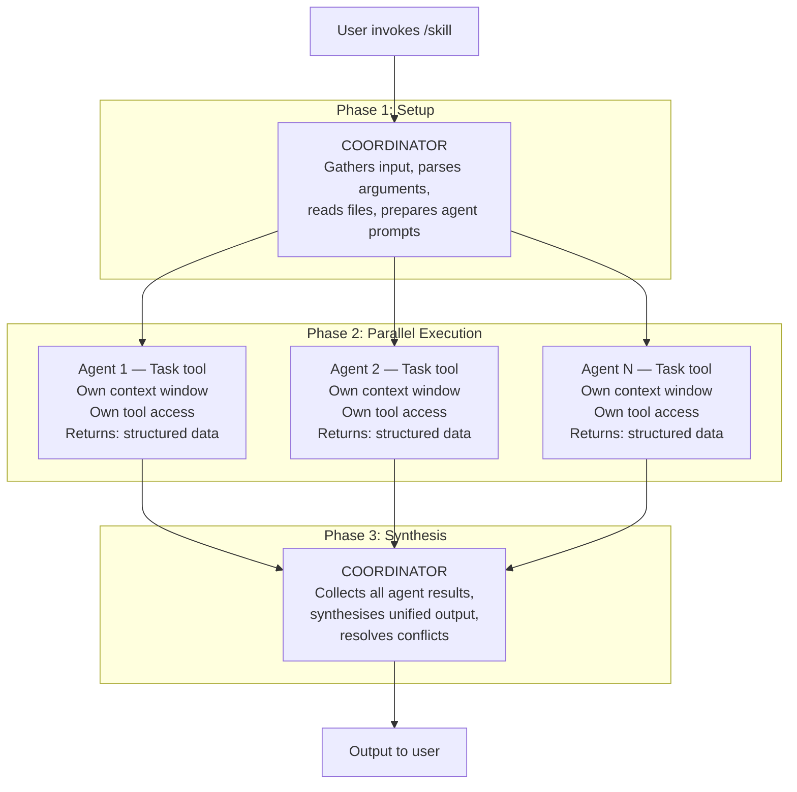
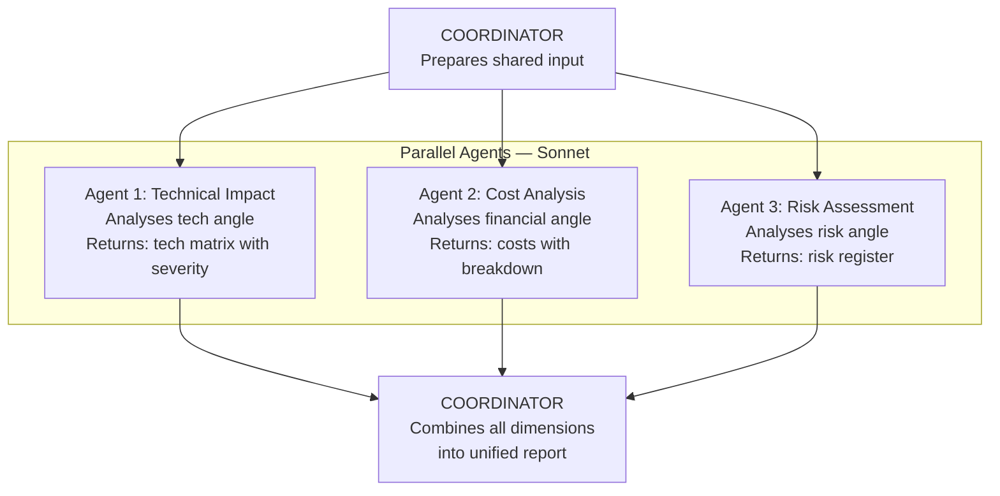
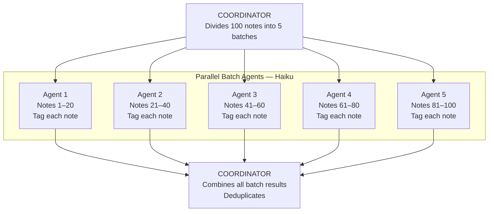
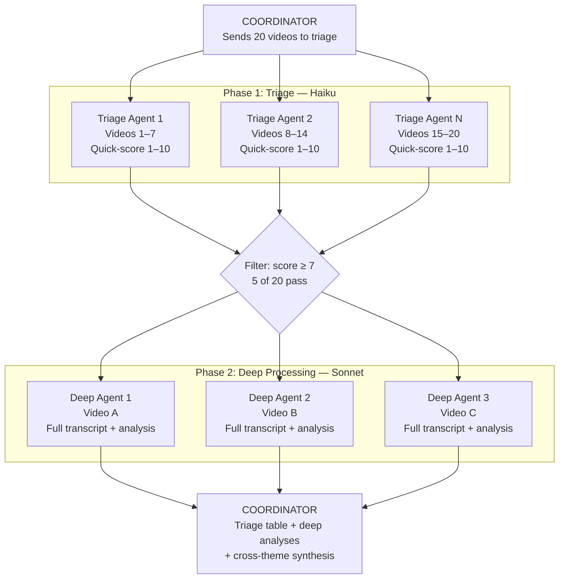
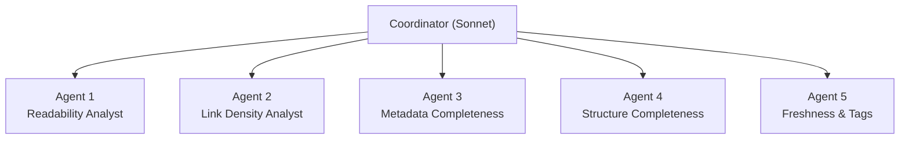
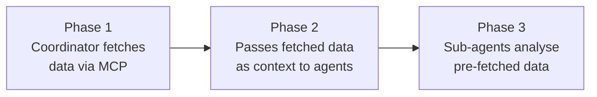

# Agent Teams Guide

A comprehensive guide to using parallel sub-agents in Claude Code skills for faster, more thorough execution. Agent teams are the key architectural pattern that separates a good skill from a great one — they turn sequential bottlenecks into parallel pipelines.

## Table of Contents

- [What Are Agent Teams?](#what-are-agent-teams)
- [When to Use Agent Teams](#when-to-use-agent-teams)
- [Agent Team Patterns](#agent-team-patterns)
- [Model Selection](#model-selection)
- [Best Practices](#best-practices)
- [Anti-Patterns](#anti-patterns)
- [Creating Your Own Agent Team Skills](#creating-your-own-agent-team-skills)
- [Worked Example: /quality-report](#worked-example-quality-report)
- [Performance Characteristics](#performance-characteristics)

---

## What Are Agent Teams?

Agent teams are groups of parallel sub-agents launched via Claude Code's `Task` tool. Each agent runs independently in its own context window, processes a specific piece of work, and returns structured results. A coordinator (the main skill execution) then synthesises all agent results into a unified output.

The mechanism is straightforward: Claude Code's `Task` tool can launch multiple sub-agents simultaneously. Each sub-agent is a complete Claude instance with its own context, tools, and instructions. Sub-agents cannot communicate with each other — they only communicate with the coordinator through their return values.



**Key properties of agent teams:**

- **Parallel execution** — All agents in a phase launch simultaneously and run concurrently
- **Isolated context** — Each agent has its own context window; no shared state between agents
- **Independent failure** — If one agent fails, others continue; the coordinator handles missing results
- **Structured returns** — Each agent returns data in a defined format the coordinator can combine
- **Tool access** — Sub-agents can use Read, Grep, Glob, WebFetch, and other tools (but **not** MCP tools — see [MCP Tool Limitation](#mcp-tool-limitation) below)

---

## When to Use Agent Teams

Not every skill needs agent teams. Use this decision matrix to determine whether parallel agents will improve your skill:

| Situation | Use Agents? | Reason |
|-----------|-------------|--------|
| Analysing something from 3+ independent angles | **Yes** — Fan-out | Each dimension can run in parallel |
| Processing 20+ items with the same operation | **Yes** — Batch | Divide into batches for parallel throughput |
| Filtering a large list before deep analysis | **Yes** — Triage | Fast scoring before expensive processing |
| Interactive Q&A with the user | **No** | Agents cannot prompt the user for input |
| Sequential steps where each depends on the previous | **No** | No parallelism benefit; adds overhead |
| Simple single-file read and transform | **No** | Overhead exceeds benefit for trivial tasks |
| Task requiring MCP tools (Notion, YouTube, etc.) | **No** (in agents) | MCP tools unavailable in sub-agents |
| Processing 5-10 items | **Maybe** | Marginal benefit; test whether overhead is worthwhile |
| Analysis with 2 dimensions | **Maybe** | 2 agents have less benefit than 3-5; consider sequential |

**Rule of thumb:** If the work can be split into 3+ independent chunks that each take 10+ seconds, agent teams will provide a meaningful speedup. Below that threshold, the overhead of launching agents may not be worth it.

---

## Agent Team Patterns

Three orchestration patterns cover nearly all agent team use cases in this collection.

### Pattern 1: Fan-Out/Fan-In

The most common pattern. Multiple agents analyse different dimensions of the **same input** in parallel, then the coordinator synthesises their results into a unified report.



**Characteristics:**
- 3-5 agents (more than 5 increases overhead without proportional benefit)
- All agents read the same input but analyse different dimensions
- Each agent returns a different data structure (risk register, cost table, etc.)
- The coordinator's synthesis phase is where the real value is — combining perspectives

**Skills using Fan-Out/Fan-In:**

| Skill | Agents | Dimensions |
|-------|--------|------------|
| `/impact-analysis` | 4 | Technical, organisational, financial, risk |
| `/scenario-compare` | 3 | Cost/financial, technical/complexity, risk/timeline |
| `/nfr-review` | 3 | Completeness, measurability, feasibility |
| `/quality-report` | 5 | Readability, links, metadata, structure, freshness |
| `/architecture-report` | 5 | Inventory, integration, decisions, risk, finance |
| `/cost-analysis` | 3 | Infrastructure, licensing, operational |
| `/score-document` | 4 | Section-by-section scoring |
| `/weekly-summary` | 5 | Daily notes, tasks, meetings, decisions, projects |
| `/project-report` | 4 | Tasks, meetings, risks, timeline |
| `/broken-links` | 3 | Wiki-links, heading anchors, attachments |
| `/orphan-finder` | 4 | Entity orphans, node orphans, event orphans, connection suggester |
| `/meeting-notes` | 3 | Decisions, action items, topic summaries |
| `/book-notes` | 3 | Concepts, frameworks, actionable insights |

### Pattern 2: Batch Processing

Used when the **same operation** needs to run on many items. Items are divided into equal-sized batches and each batch is processed by an independent agent.



**Characteristics:**
- N agents (scales with input size; typically 1 agent per 15-20 items)
- All agents run the **same logic** on different data
- Haiku model preferred (cost-effective for repetitive work)
- Coordinator merges results and deduplicates

**Skills using Batch Processing:**

| Skill | Batch Size | Agent Model | Operation |
|-------|------------|-------------|-----------|
| `/auto-tag` | 15-20 notes | Haiku | Analyse content, suggest tags |
| `/auto-summary` | 15-20 notes | Haiku | Generate one-line summaries |
| `/link-checker` | 10-15 URLs | Haiku | Validate HTTP status codes |

### Pattern 3: Triage + Selective Processing

A two-phase pattern for large lists where only some items are worth deep analysis. Phase 1 uses fast, cheap agents to score everything; Phase 2 uses more capable agents only on high-scoring items.



**Characteristics:**
- Two-phase execution (Phase 2 depends on Phase 1 results)
- Phase 1: Fast, cheap agents score everything (Haiku)
- Filter: Only items above a threshold proceed to Phase 2
- Phase 2: Capable agents deeply process the filtered set (Sonnet)
- **Cost optimisation:** If 20% of items are worth deep analysis, you save 80% of Sonnet costs

**Skills using Triage + Selective:**

| Skill | Triage Agent | Deep Agent | Threshold |
|-------|-------------|------------|-----------|
| `/video-digest` | Haiku (score 1-10) | Sonnet (full analysis) | ≥ 7 (configurable) |

---

## Model Selection

Choosing the right model for each agent is critical for balancing cost, speed, and quality.

### Model Comparison

| Attribute | Haiku | Sonnet | Opus |
|-----------|-------|--------|------|
| **Input cost** | ~$1/MTok | ~$3/MTok | ~$15/MTok |
| **Output cost** | ~$5/MTok | ~$15/MTok | ~$75/MTok |
| **Speed** | Fastest | Medium | Slowest |
| **Reasoning** | Basic | Strong | Deepest |
| **Context window** | 200k | 200k | 200k |
| **Best for agents** | Batch work, scanning, tagging | Analysis, scoring, synthesis | Deep architectural reasoning |

### When to Use Each Model as a Sub-Agent

| Agent Task | Model | Rationale | Example Skill |
|------------|-------|-----------|---------------|
| File scanning and pattern matching | Haiku | Fast, cheap, no reasoning needed | `/broken-links` agents |
| Batch processing (tagging, summarising) | Haiku | Cost-effective at scale (100+ items) | `/auto-tag`, `/auto-summary` |
| Triage scoring (quick relevance assessment) | Haiku | Speed matters more than depth | `/video-digest` Phase 1 |
| Content analysis and scoring | Sonnet | Needs reasoning but not extended thinking | `/score-document` agents |
| Multi-dimensional analysis | Sonnet | Good balance of quality and cost | `/impact-analysis` agents |
| Complex synthesis and comparison | Sonnet | Needs to weigh trade-offs | `/scenario-compare` agents |
| Deep architectural reasoning | Opus | Extended thinking for complex problems | Custom skills (rare) |

### Cost Examples

**5-agent fan-out quality report (Sonnet agents):**
- Each agent reads ~50 notes ≈ ~100k tokens input, ~20k tokens output
- 5 agents total: ~500k input + ~100k output
- Cost: (500k × $3/MTok) + (100k × $15/MTok) = $1.50 + $1.50 = **~$3.00**

**Batch tagging 100 notes (Haiku agents):**
- 5 agents, 20 notes each ≈ ~30k tokens input, ~5k tokens output per agent
- 5 agents total: ~150k input + ~25k output
- Cost: (150k × $1/MTok) + (25k × $5/MTok) = $0.15 + $0.13 = **~$0.28**

**Triage 20 videos (Haiku triage + Sonnet deep):**
- Phase 1: 3 Haiku agents ≈ ~60k input, ~10k output = $0.06 + $0.05 = $0.11
- Phase 2: 4 Sonnet agents (20% pass triage) ≈ ~200k input, ~40k output = $0.60 + $0.60 = $1.20
- Total: **~$1.31** (vs ~$6.50 if all 20 processed by Sonnet)

---

## Best Practices

### 1. Limit to 3-5 Parallel Agents

More agents means more overhead (prompt construction, result parsing, synthesis complexity) without proportional benefit. Beyond 5 agents, the coordinator's synthesis phase becomes the bottleneck.

| Agents | Speedup | Synthesis Complexity |
|--------|---------|---------------------|
| 2 | ~1.8x | Low |
| 3 | ~2.5x | Low |
| 4 | ~3.2x | Medium |
| 5 | ~3.8x | Medium |
| 6+ | ~4.0x | High (diminishing returns) |

If you need to cover more than 5 dimensions, consider grouping related dimensions into a single agent (e.g., "security and compliance" rather than two separate agents).

### 2. Write Complete Agent Prompts (No Shared State)

Each agent runs in its own context window with **no access** to the coordinator's context or other agents' results. The agent prompt must contain everything the agent needs:

- **Full task description** — What to analyse and how
- **Input data** — File paths, search terms, or pre-fetched content
- **Step-by-step instructions** — Specific actions to take
- **Return format** — Exact structure of the expected output
- **Quality criteria** — What constitutes good vs poor output

```markdown
# GOOD: Self-contained agent prompt
"Read all .md files in ADRs/. For each file, parse the YAML frontmatter
and check for these fields: type, title, created, status, deciders. Score
completeness as: (fields present / 5) × 100. Return a JSON array of
{ filename, score, missingFields[] }."

# BAD: Assumes shared context
"Check the ADR files for the fields we discussed earlier and score them."
```

### 3. Define Explicit Return Formats

Agents must return data in a format the coordinator can programmatically combine. Be specific about structure:

```markdown
# GOOD: Explicit return format
Return: JSON array of objects:
  { filename: string, score: number (0-100), issues: string[] }

# GOOD: Markdown table format
Return: Markdown table with columns:
  | Filename | Score | Missing Fields | Recommendation |

# BAD: Vague return format
Return: A summary of what you found
```

### 4. Handle Agent Failures Gracefully

Agents can fail (timeout, context exhaustion, parsing errors). The coordinator should:

- Check whether each agent returned valid results
- Continue synthesis with available results if one agent fails
- Note which dimension is missing in the output
- Never crash the entire skill because one agent failed

```markdown
# In the synthesis phase:
If any agent failed to return results:
1. Note the missing dimension in the report
2. Mark that section as "Analysis unavailable"
3. Reduce confidence in the overall score
4. Suggest re-running the skill for complete results
```

### 5. Keep Agents Focused on One Dimension

Each agent should own exactly one dimension of analysis. Splitting work cleanly ensures:

- No duplicate analysis (wasted cost)
- Clear responsibility (no ambiguity about which agent covers what)
- Easy debugging (test one agent at a time)
- Combinable results (each agent's output is a distinct piece of the puzzle)

```markdown
# GOOD: One dimension per agent
Agent 1: Technical impact (systems, APIs, data)
Agent 2: Organisational impact (teams, skills, processes)
Agent 3: Financial impact (costs, savings, ROI)

# BAD: Overlapping dimensions
Agent 1: Technical and security analysis
Agent 2: Security and compliance analysis  ← overlaps with Agent 1
Agent 3: Cost and technical debt analysis  ← overlaps with Agent 1
```

---

## Anti-Patterns

Common mistakes when designing agent team skills:

| Anti-Pattern | Problem | Fix |
|--------------|---------|-----|
| **Too many agents (6+)** | Diminishing returns; synthesis phase becomes a bottleneck | Limit to 3-5; group related dimensions |
| **Sequential work in parallel agents** | Step 2 needs Step 1's output — agents cannot communicate | Use phases: Phase 1 agents → coordinator → Phase 2 agents |
| **Vague agent prompts** | "Analyse the document" produces inconsistent, unhelpful results | Specify exact steps, input files, and return format |
| **No return format specified** | Agents return free-form prose that cannot be combined | Define structured return: JSON, tables, or specific Markdown sections |
| **Shared state assumptions** | Agent refers to "the systems we identified earlier" | Include all context in each agent's prompt |
| **Using Opus for batch work** | 15× more expensive than Haiku for simple tagging | Use Haiku for batch; Sonnet for analysis; Opus only for deep reasoning |
| **Single-item agents** | One agent per note in a 500-note vault | Use batch processing: 15-20 items per agent |
| **Agents prompting the user** | Agent needs clarification but cannot interact | Coordinator gathers all user input in Phase 1 before launching agents |
| **MCP tools in agents** | Agent tries to call Notion/YouTube MCP tools | Coordinator fetches MCP data first, passes it as context |
| **No failure handling** | One agent fails, entire skill crashes | Coordinator checks each result; continues with partial data |
| **Overlapping dimensions** | Two agents analyse "security" from slightly different angles | One agent per dimension; merge related concerns |
| **Agents writing files** | Agents try to save results to the filesystem | Agents return data; coordinator decides what to write |

---

## Creating Your Own Agent Team Skills

A five-step guide to building skills with parallel agents.

### Step 1: Identify Parallel Dimensions

Ask: "Can I split this work into 3-5 independent chunks where each chunk doesn't need the others' results?"

**Fan-out test:** If you're analysing something from multiple angles (cost, risk, technical, organisational), each angle is a dimension.

**Batch test:** If you're applying the same operation to many items, you have a batch processing opportunity.

**Triage test:** If only some items in a large list are worth deep processing, you have a triage opportunity.

### Step 2: Define Each Agent's Contract

For each agent, specify:

```markdown
**Agent N: <Descriptive Name>** (<Model>)
Task: <One-sentence purpose — what question does this agent answer?>
- <Step 1 — specific, actionable instruction>
- <Step 2 — specific, actionable instruction>
- <Step 3 — specific, actionable instruction>
Return: <Exact data structure — fields, types, format>
```

### Step 3: Design the Synthesis Phase

Plan how the coordinator will combine agent results:

1. What is the unified output format?
2. How are scores/metrics from different agents combined? (weighted average? matrix?)
3. What happens if one agent's findings contradict another's?
4. What happens if an agent fails to return results?

### Step 4: Write the Skill File

Follow the standard skill template (see [Skills Reference](skills-reference.md)):

```markdown
---
description: <one-line description>
model: sonnet
---

# /<skill-name>

<Purpose paragraph>

## When to Use This Skill
## Usage
## Instructions

### Phase 1: <Setup — gather input, prepare agent prompts>
### Phase 2: <Agent Team — define all agents>
### Phase 3: <Synthesise — combine results, generate output>

## Output Format
## Examples
```

### Step 5: Test and Iterate

1. **Test each agent independently** — Run one agent at a time to verify it returns the expected format
2. **Test the synthesis** — Verify the coordinator correctly combines all agent outputs
3. **Test failure handling** — Simulate one agent failing and verify graceful degradation
4. **Benchmark cost** — Calculate actual token usage to confirm cost estimates
5. **Compare against sequential** — Verify the agent team actually provides a speedup vs sequential execution

Use the [`/skill-creator`](../skills/knowledge/skill-creator.md) skill to generate the boilerplate for your agent team skill.

---

## Worked Example: /quality-report

Let's walk through exactly how the [`/quality-report`](../skills/vault-health/quality-report.md) skill executes, from invocation to final output. This skill uses a 5-agent fan-out pattern to analyse vault quality across five dimensions.

### Step 1: User Invokes the Skill

```
/quality-report --type ADR --top-issues 10
```

The user wants a quality report for all ADR notes, with the top 10 issues highlighted.

### Step 2: Coordinator Parses Arguments and Inventories Files

The coordinator (main skill execution, running on Sonnet):

1. Parses arguments: `type=ADR`, `topIssues=10`
2. Scans the vault using Glob: `ADRs/ADR - *.md`
3. Finds 25 ADR files
4. Reads frontmatter from each to extract type, tags, and dates
5. Prepares a file list to pass to each agent

### Step 3: Coordinator Launches 5 Agents in Parallel

The coordinator makes 5 simultaneous `Task` tool calls. Each agent receives:

- The list of 25 ADR file paths
- The specific analysis instructions for its dimension
- The expected return format



| Agent | Task | Return Format |
|-------|------|---------------|
| **Readability** | Read 25 ADRs, calculate Flesch Reading Ease, score 0–100 | `{ filename, readabilityScore, gradeLevel, issues[] }` |
| **Link Density** | Count outgoing wiki-links, build backlink index, identify orphans | `{ filename, linkScore, outgoing, backlinks, isOrphan }` |
| **Metadata** | Parse frontmatter, check required fields (type, title, created, status, deciders), score 0–100 | `{ filename, metadataScore, missingRequired[], missingRecommended[] }` |
| **Structure** | Check expected sections (Context, Decision, Rationale, Consequences, Alternatives), score 0–100 | `{ filename, structureScore, missingSections[], emptySections[] }` |
| **Freshness & Tags** | Check modification dates, categorise freshness, validate tags, score 0–100 | `{ filename, freshnessScore, daysSinceUpdate, tagCount, tagIssues[] }` |

### Step 4: Agents Execute in Parallel

All 5 agents run simultaneously. Each:

1. Receives its prompt with the file list and instructions
2. Reads the 25 ADR files using the Read tool
3. Analyses its assigned dimension
4. Returns structured data in the specified format

This takes roughly the same wall-clock time as a single agent, despite doing 5× the analytical work.

### Step 5: Coordinator Collects All Results

When all agents complete, the coordinator receives 5 structured result sets:

```
Agent 1 → 25 readability scores with grade levels
Agent 2 → 25 link density scores with orphan flags
Agent 3 → 25 metadata scores with missing field lists
Agent 4 → 25 structure scores with missing section lists
Agent 5 → 25 freshness scores with tag issues
```

### Step 6: Coordinator Synthesises the Report

The coordinator now:

1. **Joins data by filename** — Combines all 5 scores per file into a single record
2. **Calculates the weighted overall score** per file:
   ```
   overall = readability×0.20 + linkDensity×0.25 + metadata×0.20 + structure×0.20 + freshness×0.15
   ```
3. **Assigns grades** — A (90+), B (80-89), C (70-79), D (60-69), F (<60)
4. **Ranks by score** — Identifies the bottom 10 (worst quality)
5. **Calculates vault-wide averages** — Overall score, per-dimension averages
6. **Identifies cross-cutting issues** — e.g., "15 of 25 ADRs are missing the `summary` field"
7. **Generates recommendations** — Prioritised by impact

### Step 7: Output to User

The final report is presented as a structured Markdown document:

```markdown
# Vault Quality Report

**Date:** 2026-02-11 | **Scope:** ADRs/ | **Notes Analysed:** 25

## Overall Score: 72/100 (Grade: C)

| Dimension      | Score | Weight | Weighted |
|----------------|-------|--------|----------|
| Readability    | 78    | 20%    | 15.6     |
| Link Density   | 65    | 25%    | 16.3     |
| Metadata       | 80    | 20%    | 16.0     |
| Structure      | 74    | 20%    | 14.8     |
| Freshness      | 60    | 15%    | 9.0      |
| **Overall**    |       | 100%   | **71.7** |

## Top 10 Issues (Prioritised)

| # | Note                           | Score | Grade | Primary Issue              |
|---|-------------------------------|-------|-------|---------------------------|
| 1 | ADR - Legacy API Gateway.md   | 38    | F     | Stale, no links, missing sections |
| 2 | ADR - Batch Processing.md     | 45    | F     | Orphaned, no summary      |
...

## Recommendations

1. **Quick wins:** Add `summary` to 15 ADRs (improves metadata score by ~12 points)
2. **Link building:** Connect 8 orphaned ADRs to projects and systems
3. **Structure:** Add missing "Alternatives Considered" to 6 ADRs
```

---

## Performance Characteristics

Agent teams provide near-linear speedup for independent work. The table below shows measured characteristics for vault health operations:

### Sequential vs Agent Team Execution

| Vault Size | Operation | Sequential | 5 Agents | Speedup |
|------------|-----------|-----------|----------|---------|
| 100 notes | Quality report (5 dimensions) | ~5 min | ~1.5 min | ~3.3× |
| 100 notes | Auto-tag (batch) | ~8 min | ~2 min | ~4× |
| 500 notes | Quality report (5 dimensions) | ~25 min | ~6 min | ~4.2× |
| 500 notes | Auto-tag (batch) | ~40 min | ~9 min | ~4.4× |
| 2000 notes | Quality report (5 dimensions) | ~100 min | ~22 min | ~4.5× |
| 2000 notes | Auto-tag (batch, 10 agents) | ~160 min | ~18 min | ~8.9× |

**Notes:**
- Speedup is sub-linear due to coordinator overhead (prompt construction, result parsing, synthesis)
- Batch processing scales better (more agents = more parallelism) than fan-out (fixed at 3-5 agents)
- Agent launch overhead is ~5-10 seconds per agent, amortised across the work
- At 2000+ notes, batch processing with 10+ agents approaches near-linear speedup
- These are estimates based on typical token counts; actual times vary with note size and complexity

### Cost Scaling

| Vault Size | Operation | Haiku Cost | Sonnet Cost | Savings vs Sequential |
|------------|-----------|-----------|-------------|----------------------|
| 100 notes | Auto-tag | ~$0.28 | ~$1.40 | Same cost, 4× faster |
| 100 notes | Quality report | N/A | ~$3.00 | Same cost, 3.3× faster |
| 500 notes | Auto-tag | ~$1.40 | ~$7.00 | Same cost, 4.4× faster |
| 500 notes | Quality report | N/A | ~$15.00 | Same cost, 4.2× faster |

Agent teams don't save cost — they save time. The total tokens processed are the same; they're just processed in parallel. The exception is the **triage pattern**, which saves both time and cost by filtering before deep processing.

### MCP Tool Limitation

MCP tools (Notion, YouTube, Diagrams, and other MCP server integrations) are **not available** inside sub-agents launched via the `Task` tool. This is a platform limitation — the Task tool creates isolated agent instances without MCP server connections.

**Workaround:** The coordinator must call MCP tools before launching agents, then pass the fetched data as part of the agent prompt.



---

## Further Reading

- [Skills Reference](skills-reference.md) — Quick-reference table of all 37 skills with agent team details
- [Blog Post](blog-post.md) — The theory behind the diagramming skills (layout algorithms, graph drawing research)
- [`/skill-creator`](../skills/knowledge/skill-creator.md) — Generate new skill files with agent team boilerplate
