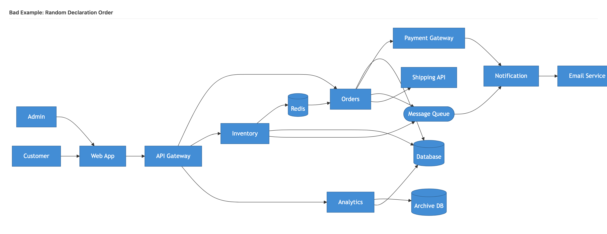
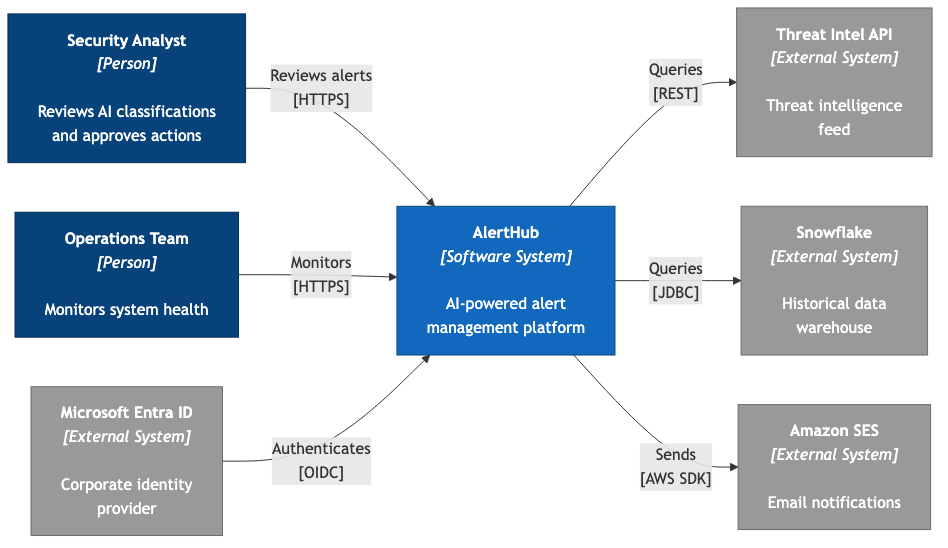
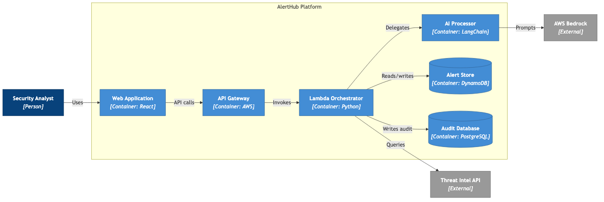

# Why Your AI-Generated Diagrams Look Terrible (And How to Fix Them)

*A Solutions Architect working in airline operations IT*

You asked Claude to "generate a C4 diagram for my order processing system." It produced fifteen elements scattered randomly across the page, with relationships crossing each other like a plate of spaghetti. The diagram is technically correct. Every element is there. Every relationship is accurate. But it is completely impossible to follow.

So you try again. "Make it cleaner." The AI shuffles some things around and produces something equally unreadable. You try "simplify it" and lose half your components. Three iterations later, you give up and draw it by hand.

This is the experience of almost every architect and developer using AI tools to generate diagrams. The problem is not the AI. The problem is that you are giving it instructions the layout algorithm cannot act on.


*What you typically get: 15 elements, random declaration order, relationships crossing everywhere.*

## The Science Nobody Tells You About

There is actual peer-reviewed research on what makes diagrams readable, and almost nobody in the AI tooling space talks about it.

Helen Purchase at the University of Queensland conducted empirical studies comparing different graph aesthetics. Her finding was unambiguous: **edge crossings are the single most important factor affecting diagram comprehension**. Not alignment. Not colour. Not overall size. Crossings.

When two lines cross, the reader must pause and mentally untangle which path belongs to which connection. This measurable increase in cognitive load directly reduces comprehension speed and accuracy. Purchase's studies showed that reducing crossings improved reader accuracy by 30-40%.

Here is the part that matters for AI-generated diagrams. The layout algorithms that render your Mermaid and PlantUML code -- Dagre and Sugiyama respectively -- position elements based on **declaration order in the code**. The AI writes the code; the algorithm decides where things go. And the crossing minimisation stage of these algorithms is NP-hard, which means results depend heavily on the initial element ordering.

Put simply: if the AI declares your database first and your user last, the algorithm starts from a terrible position and produces a terrible layout. If the AI declares elements in reading order, the algorithm starts close to a good solution and produces far fewer crossings.

There is one more principle that matters. The Gestalt principle of proximity states that elements placed close together are perceived as related. This is strong enough to override colour or shape similarity. If your API Gateway is visually closer to an external system than to the services it routes to, the reader's brain groups it with the wrong things -- regardless of the colour coding.

## What NOT to Do

### Antipattern 1: Random Element Order

This is the most common failure mode. The AI declares elements in whatever order it thinks of them:

```
Database, Cache, External, Notify, Inventory, API, Orders, Web, User
```

The database is declared first but should be rightmost. The user is declared last but should be leftmost. The layout algorithm must reposition everything, and its barycentric heuristic -- which calculates average positions of connected neighbours -- struggles because neighbours appear in unexpected positions.

Now compare this with declaring elements in reading order:

```
User, Web, API, Orders, Inventory, Notify, External, DB, Cache
```

Same nine elements. Same twelve relationships. The only difference is declaration order. The second version produces a clean left-to-right flow with minimal crossings. The first produces chaos.

| Bad: Random declaration order | Good: Tier-based declaration order |
|---|---|
|  |  |

*Left: Database declared first, User declared last. Right: User declared first, Database declared last. Same elements, same relationships — only the declaration order changed.*

### Antipattern 2: Vague Refinement Requests

"Make it cleaner" -- the AI does not know what "clean" means in layout terms.

"Add more detail" -- this mixes abstraction levels. You get database table names appearing on a container diagram, which violates one of the core principles of C4 modelling.

"Simplify it" -- the AI removes elements rather than improving their arrangement.

Instead, be specific: "The diagram has a crossing between Inventory-to-Database and Orders-to-Payment. Swap the declaration order of Orders and Inventory to align with left-to-right flow." That is an instruction the AI can act on, because it maps directly to what the layout algorithm needs.

### Antipattern 3: Relationships Before Elements

Declaring connections before declaring what they connect means the layout algorithm has no starting positions to work with. It must simultaneously figure out where everything goes and how to route edges.

The fix is straightforward: declare ALL elements first, THEN all relationships.

### Antipattern 4: No Crossing Target

If you do not tell the AI to minimise crossings, it accepts any layout. It has no reason to optimise for readability unless you explicitly ask.

Set targets: "Maximum 2 edge crossings" for a simple diagram, or "Fewer than 5 crossings" for complex ones. Zero is ideal for anything with fewer than seven elements.

## What TO Do: The Structured Prompt

The fix is a structured prompt that gives the AI the information the layout algorithm needs. Here is the approach, broken into four steps.

### Step 1: Specify Elements in Tier Order

Think of your architecture in horizontal tiers, reading left to right:

- **Tier 1: Actors** (leftmost) -- the people who use the system
- **Tier 2: Presentation layer** -- web apps, UIs
- **Tier 3: API layer** -- gateways, routers
- **Tier 4: Service layer** -- business logic
- **Tier 5: Data layer** (rightmost) -- databases, caches
- **External systems** -- outside the boundary, rightmost

Tell the AI to declare elements in this exact order.

### Step 2: Declare Relationships in Flow Order

After all elements are declared, list relationships following the same left-to-right flow. Actor uses UI. UI calls API. API routes to services. Services read from databases. Services call external systems.

### Step 3: Specify Styling

The C4 model no longer prescribes a specific colour scheme -- Simon Brown intentionally removed it so teams can choose colours that work for their context. But you still need colour to reinforce the visual hierarchy. As Jacqui Read writes in *Communication Patterns*, **colour should encode meaning, not just decorate**.

Her key principles for diagram styling:

- **Use colour to distinguish element types**, not to make things look pretty. If persons, containers, and external systems all look the same, the reader loses a quick visual shorthand for "what kind of thing is this?"
- **Ensure sufficient contrast.** Roughly 8% of men have some form of colour vision deficiency. Do not rely on hue alone -- vary lightness and saturation so elements remain distinguishable in greyscale.
- **Be consistent across a diagram set.** If persons are dark blue on the Context diagram, they must be dark blue on the Container diagram. Inconsistency forces readers to re-learn the visual language on every page.
- **Visually recede what is outside your scope.** External systems and third-party services should be muted (grey or desaturated) so the reader's eye is drawn to what you control.

A practical colour set that follows these principles:

- **Persons:** Dark, saturated (e.g., `#08427B`) -- the starting point of every interaction
- **Your containers:** Medium saturation (e.g., `#438DD5`) -- the system under discussion
- **External systems:** Grey or desaturated (e.g., `#999999`) -- outside your control, visually recedes
- **System boundary:** Subtle background (e.g., light grey `#F5F5F5` with border) -- groups without competing

The specific hex values matter less than the principle: **your system should be visually prominent, external dependencies should recede, and every colour distinction should mean something**.

### Step 4: Set Constraints

Specify layout direction (LR for left-to-right, TB for top-to-bottom), maximum crossing count, and use subgraphs for system boundaries.

### The Copy-Paste Prompt Template

Here is a prompt template you can use directly with any AI tool:

```
Generate a Mermaid C4 Container diagram.

System: [SYSTEM NAME]

Elements (declare in this exact left-to-right order):
1. [Actor] [Person] - leftmost
2. [UI] [Container: Technology]
3. [API] [Container: Technology]
4. [Service1] [Container: Technology]
5. [Service2] [Container: Technology]
6. [Database] [Container: Technology] - rightmost
7. [External] [External System] - rightmost

Relationships (in flow order):
- Actor --> UI (Uses, HTTPS)
- UI --> API (API calls, REST)
- API --> Service1 (Routes)
- API --> Service2 (Routes)
- Service1 --> Database (Reads/writes, SQL)
- Service2 --> Database (Reads/writes, SQL)
- Service1 --> External (Calls, REST)

Requirements:
- Use flowchart LR
- Colour by element type: persons dark/saturated, containers medium, external grey/muted
- External systems should visually recede; your system should be prominent
- Maximum 2 edge crossings
- Group services in a subgraph boundary
- Declare ALL elements before ANY relationships
```

This template works with Claude, ChatGPT, Copilot, and any other AI tool that generates Mermaid code. The key is that you are providing information the layout algorithm can use, not just describing what you want the output to look like.

Here is what that template produces -- a clean C4 Container diagram with system boundary, tier-based layout, and zero crossings:


*The result: actors on the left, containers grouped in a system boundary, external systems on the right, clean left-to-right flow.*

## Fixing Crossings When They Happen

Sometimes the first result still has crossings, even with a structured prompt. Do not regenerate the entire diagram. Make targeted requests.

Instead of "make it cleaner," try:

- "The diagram has a crossing between X-to-Y and A-to-B. Swap declaration order of X and A to align with left-to-right flow."
- "Move Element adjacent to OtherElement by declaring them consecutively."
- "Reorder the relationship declarations so that Orders-to-Database appears before Orders-to-Payment."

You are speaking the layout algorithm's language. The AI understands these specific instructions because they map to concrete changes in the generated code.

For Mermaid specifically, declaration order is your only lever. Reorder elements within the same tier so the declaration sequence matches data flow. Reorder relationships to follow the same sequence as element declarations. Add subgraphs to constrain related elements together.

## When Mermaid Is Not Enough: PlantUML

Mermaid has one significant limitation: it provides **no directional hints**. You cannot force an element to appear to the right of another element. You can influence the layout through declaration order, but you cannot guarantee it.

PlantUML with C4-PlantUML macros solves this. It provides explicit layout control:

- `Rel_Down`, `Rel_Right`, `Rel_Up`, `Rel_Left` -- force specific edge directions
- `Lay_Right`, `Lay_Down` -- force element positions within a tier
- `LAYOUT_TOP_DOWN()`, `LAYOUT_LEFT_RIGHT()` -- set global flow direction
- `LAYOUT_WITH_LEGEND()` -- automatic C4 legend

When you have a crossing between two relationships in Mermaid and reordering declarations does not fix it, PlantUML lets you use `Rel_Right(orders, payment, "Charges", "REST")` to force the Payment Gateway to the right of the services tier, eliminating the crossing deterministically.

**Use Mermaid for** quick sketches, markdown-embedded diagrams, and anything with fewer than 15 elements. It renders natively in Obsidian, GitHub, and most documentation platforms.

**Use PlantUML for** formal documentation, diagrams with more than 15 elements, persistent crossings that Mermaid cannot resolve, and anything destined for PDF export.

The same principles work at every C4 level. Here is a Context diagram (Level 1) and a Component diagram (Level 3), both following tier-based ordering:

| C4 Context (Level 1) | C4 Component (Level 3) |
|---|---|
|  |  |

*Left: Actors, system, external systems — the highest level of abstraction. Right: Controllers, services, repositories — internal components of a single container.*

And here is a real-world example -- an AI-powered incident management platform diagrammed at Context and Container level:

| Context Diagram | Container Diagram |
|---|---|
|  |  |

*A production system with 8-9 elements per diagram, mixed relationship directions, multiple data stores, and zero crossings at both levels.*

## Automating All of This with Claude Code Skills

I have encoded all of this knowledge into three Claude Code skills that apply these principles automatically.

### /diagram

Generates architecture diagrams in multiple formats -- C4, system landscape, data flow, AWS. It automatically applies tier-based declaration ordering, includes a validation checklist (edge crossings, visual hierarchy, flow direction, grouping, abstraction level), and supports Python diagrams library (PNG), Mermaid (inline), and PlantUML output.

### /c4-diagram

Specialised for C4 architecture diagrams. Three output formats: native Mermaid C4, flowchart LR with C4 styling, and PlantUML with directional hints. It has built-in antipattern avoidance -- it declares elements before relationships and uses tier-based ordering by default. It includes iterative refinement guidance for fixing specific crossings after generation.

### /diagram-review

Analyses existing diagrams for readability and architecture quality. It uses four parallel analysis agents: Component Extraction, Relationship Mapping, Architecture Pattern Analysis, and Technology Integration. The output includes a readability assessment with edge crossing count, visual hierarchy evaluation, flow direction consistency, and grouping effectiveness. It suggests specific fixes for any issues found.

## Get the Skills

The skills are available at [github.com/DavidROliverBA/Daves-Claude-Code-Skills](https://github.com/DavidROliverBA/Daves-Claude-Code-Skills).

To install, copy the skill `.md` files to your `.claude/skills/` directory. Then invoke them with `/diagram`, `/c4-diagram`, or `/diagram-review` in Claude Code.

## The One-Line Summary

The difference between a terrible AI diagram and a good one is not asking for "cleaner." It is understanding that declaration order controls layout, and telling the AI exactly which order you want.

## References

**Research**

- Purchase, H.C., McGill, M., Colpoys, L. and Carrington, D. (2001). [Graph Drawing Aesthetics and the Comprehension of UML Class Diagrams: An Empirical Study](https://www.semanticscholar.org/paper/Graph-Drawing-Aesthetics-and-the-Comprehension-of-Purchase-McGill/527ca0518fca9efdbea27c8a3289a4c8d67e22f6). The foundational study establishing edge crossings as the strongest predictor of diagram comprehension difficulty.
- Huang, W., Eades, P. and Hong, S.H. (2014). [Larger crossing angles make graphs easier to read](https://www.sciencedirect.com/science/article/abs/pii/S1045926X14000317). When crossings are unavoidable, 90-degree angles are easier to parse than acute angles.
- Sugiyama, K., Tagawa, S. and Toda, M. (1981). [Methods for Visual Understanding of Hierarchical System Structures](https://en.wikipedia.org/wiki/Layered_graph_drawing). The original layered graph drawing algorithm used by PlantUML and GraphViz.

**Handbooks**

- Healy, P. and Nikolov, N.S. (2013). [Hierarchical Drawing Algorithms](https://cs.brown.edu/people/rtamassi/gdhandbook/chapters/hierarchical.pdf). Chapter 13 of Handbook of Graph Drawing and Visualization. Detailed treatment of the Sugiyama algorithm's four stages.
- Kobourov, S.G. (2013). [Force-Directed Drawing Algorithms](https://cs.brown.edu/people/rtamassi/gdhandbook/chapters/force-directed.pdf). Chapter 12 of Handbook of Graph Drawing and Visualization. Alternative layout approach used by some tools.

**C4 Model**

- Brown, S. (2011-present). [The C4 model for visualising software architecture](https://c4model.com/). The four-level abstraction model (Context, Container, Component, Code) referenced throughout this article.

**Tools**

- [Mermaid Layouts documentation](https://mermaid.js.org/config/layouts.html). How Mermaid's Dagre algorithm handles element positioning.
- [C4-PlantUML](https://github.com/plantuml-stdlib/C4-PlantUML). The PlantUML library providing C4 macros, directional hints, and layout control.

**Communication**

- Read, J. (2023). [Communication Patterns: A Guide for Developers and Architects](https://communicationpatternsbook.com). O'Reilly Media. Audience-first approach to technical communication, including diagram design.
- Nielsen Norman Group. [Proximity Principle in Visual Design](https://www.nngroup.com/articles/gestalt-proximity/). Practical application of Gestalt proximity to interface and diagram layout.

---

*The author is a Solutions Architect working in airline operations and engineering IT. He builds knowledge management systems with Obsidian and Claude Code, and is unreasonably passionate about making architecture diagrams legible.*
