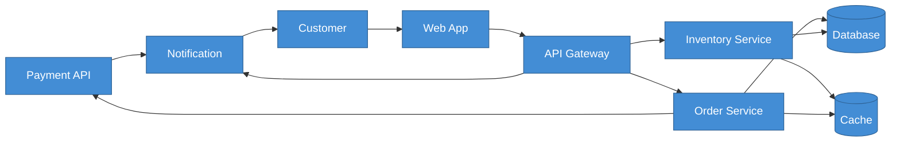
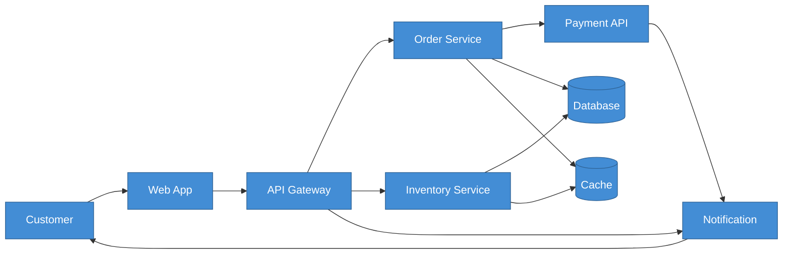

# Example: Declaration Order Matters

The single most impactful change you can make to improve AI-generated diagrams is controlling **declaration order**. The layout algorithm (Dagre for Mermaid, Sugiyama for PlantUML) positions elements based on where they appear in the code.

## The Problem

When you ask an AI to generate a diagram without specifying element order, it declares elements in whatever order it thinks of them — often rightmost elements first:

### Bad: Random Declaration Order

**Prompt used:**
```
Generate a Mermaid flowchart showing: Customer, Web App, API Gateway,
Order Service, Inventory Service, Notification, Payment API, Database, Cache.
Connect them logically.
```

**Result:**




Notice:
- Database is declared first but should be rightmost
- User is declared last but should be leftmost
- Relationships are in random order
- The layout algorithm struggles to untangle the mess

---

## The Fix

Declare elements in **reading order** (left-to-right), following architectural tiers:

1. **Actors** (leftmost)
2. **Presentation layer** (web apps, UIs)
3. **API layer** (gateways, routers)
4. **Service layer** (business logic)
5. **Data layer** (rightmost — databases, caches)
6. **External systems** (rightmost)

### Good: Tier-Based Declaration Order

**Prompt used:**
```
Generate a Mermaid flowchart LR showing the same 9 elements.

Declare elements in this exact left-to-right order:
1. Customer (actor, leftmost)
2. Web App (presentation)
3. API Gateway (API layer)
4. Order Service (service)
5. Inventory Service (service)
6. Notification (service)
7. Payment API (external, rightmost)
8. Database (data layer)
9. Cache (data layer)

Declare ALL elements before ANY relationships.
Declare relationships in flow order (left to right).
Maximum 2 edge crossings.
```

**Result:**




**Same 9 elements. Same relationships. The only change is declaration order.** The result has a clean left-to-right flow with minimal edge crossings.

---

## Why This Works

The Dagre layout algorithm uses a **barycentric heuristic** to position elements. It calculates each element's ideal position as the average of its connected neighbours' positions. When elements are declared in reading order, the algorithm starts close to a good solution. When they are random, it starts from a poor position and the NP-hard crossing minimisation stage cannot fully recover.

Research by Helen Purchase (University of Queensland) showed that **edge crossings are the strongest predictor of diagram comprehension difficulty**. Reducing crossings improved reader accuracy by 30-40%.

## Key Takeaways

- Always specify declaration order in your prompts
- Follow the tier pattern: Actors → Presentation → API → Services → Data → External
- Declare ALL elements before ANY relationships
- Order relationships to follow the same left-to-right flow as elements
- Set an explicit crossing target (e.g., "maximum 2 edge crossings")

---

**Related skill:** [`/diagram`](../../skills/diagramming/diagram.md) applies tier-based ordering automatically.
