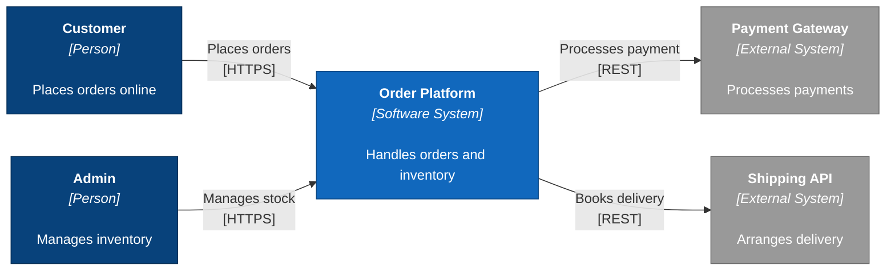

# Example: C4 Context Diagram

A C4 Context diagram (Level 1) shows **who uses the system** and **what external systems it depends on**. It is the highest level of abstraction — no internal components, just actors and system boundaries.

## The Prompt

```
/c4-diagram OrderPlatform context flowchart

System: Order Platform
Description: Handles orders and inventory

Actors:
- Customer: Places orders online
- Admin: Manages inventory

External systems:
- Payment Gateway: Processes payments (outgoing, REST)
- Shipping API: Arranges delivery (outgoing, REST)

Requirements:
- Use flowchart LR with C4 styling
- Persons in dark blue (#08427B)
- System in medium blue (#1168BD)
- External systems in grey (#999999)
- Maximum 0 edge crossings
```

## The Result




## What Makes This Good

### Declaration Order
Elements are declared in tier order:
1. **Actors first** (Customer, Admin) — leftmost
2. **Central system** (Order Platform) — middle
3. **External systems** (Payment, Shipping) — rightmost

### C4 Styling
- **Dark blue** (`#08427B`) for persons — the most prominent elements
- **Medium blue** (`#1168BD`) for the system under discussion
- **Grey** (`#999999`) for external systems — visually recedes

### Label Format
Each element uses the C4 convention:
```
<b>Name</b>
<i>[Type]</i>

Description
```

This tells the reader *what it is* and *what role it plays* at a glance.

### Relationship Labels
Each connection includes:
- **What happens** ("Places orders", "Processes payment")
- **How** (protocol in brackets: `[HTTPS]`, `[REST]`)

### Zero Crossings
With 5 elements and a clean left-to-right flow, there are zero edge crossings. Every relationship can be traced without ambiguity.

## Common Mistakes to Avoid

- **Too many actors** — Keep to 2-3 key personas. More belongs on a stakeholder map.
- **Internal components** — Do not show databases or services. That is Level 2 (Container).
- **Missing descriptions** — Every element should explain its purpose in under 40 characters.
- **No protocol labels** — Relationships without technology context are less useful.

---

**Related skill:** [`/c4-diagram`](../../skills/diagramming/c4-diagram.md) generates this format automatically from system parameters.
