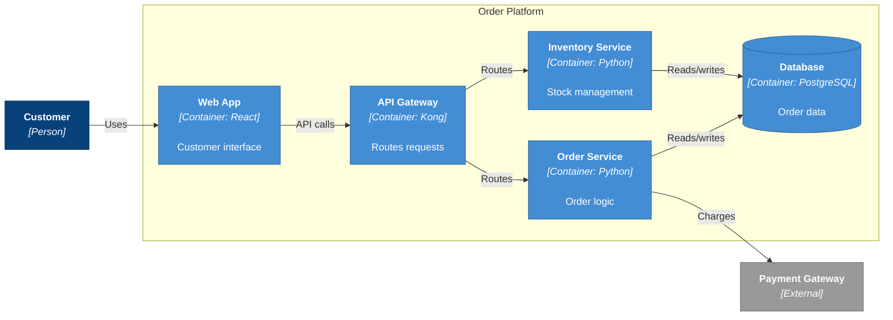

# Example: C4 Container Diagram

A C4 Container diagram (Level 2) zooms into a system boundary to show its **major containers** — applications, services, databases — and how they interact. It answers: "What runs inside the system?"

## The Prompt

```
/c4-diagram OrderPlatform container flowchart

System: Order Platform

Actor:
- Customer: Uses the system

Containers (inside the system boundary):
- Web App (React): Customer interface
- API Gateway (Kong): Routes requests
- Order Service (Python): Order logic
- Inventory Service (Python): Stock management
- Database (PostgreSQL): Order data

External systems:
- Payment Gateway: Processes payments (outgoing, REST)

Requirements:
- Use flowchart LR with C4 styling
- Group containers in a subgraph boundary
- Persons in dark blue (#08427B)
- Containers in medium blue (#438DD5)
- External systems in grey (#999999)
- Maximum 0 edge crossings
```

## The Result




## What Makes This Good

### System Boundary
The `subgraph` groups all internal containers, making the system boundary immediately visible. This exploits the **Gestalt principle of proximity** — elements inside the boundary are perceived as part of the same system.

### Tier-Based Declaration Order
Inside the boundary, containers follow the architectural flow:
1. **Web App** (presentation) — leftmost inside boundary
2. **API Gateway** (routing layer)
3. **Order Service** (business logic)
4. **Inventory Service** (business logic)
5. **Database** (data layer) — rightmost inside boundary

### Technology Labels
Each container includes its technology stack: `[Container: React]`, `[Container: Python]`, `[Container: PostgreSQL]`. This tells the reader both *what it does* and *how it is built*.

### Database Shape
The database uses Mermaid's cylinder notation `[("...")]` which visually distinguishes data stores from application containers. Use this for any element whose technology contains: PostgreSQL, MySQL, DynamoDB, Redis, MongoDB, S3, Snowflake.

### Clean Flow
Data flows consistently left-to-right: User → Web → API → Services → Database/External. No backtracking, no crossings.

## Scaling Up

When a container diagram has more than 10 elements:
- Show only the 6-8 most critical containers
- Add a note listing omitted containers
- Consider splitting into multiple diagrams by domain

## PlantUML Alternative

For complex container diagrams with persistent crossings, PlantUML provides directional hints:

```plantuml
@startuml
!include https://raw.githubusercontent.com/plantuml-stdlib/C4-PlantUML/master/C4_Container.puml

LAYOUT_LEFT_RIGHT()
LAYOUT_WITH_LEGEND()

title Container Diagram for Order Platform

Person(user, "Customer", "Uses the system")

System_Boundary(boundary, "Order Platform") {
    Container(web, "Web App", "React", "Customer interface")
    Container(api, "API Gateway", "Kong", "Routes requests")
    Container(orders, "Order Service", "Python", "Order logic")
    Container(inventory, "Inventory Service", "Python", "Stock management")
    ContainerDb(db, "Database", "PostgreSQL", "Order data")
}

System_Ext(payment, "Payment Gateway", "Processes payments")

Rel_Right(user, web, "Uses", "HTTPS")
Rel_Right(web, api, "API calls", "REST")
Rel_Down(api, orders, "Routes")
Rel_Down(api, inventory, "Routes")
Rel_Right(orders, db, "Reads/writes", "SQL")
Rel_Right(inventory, db, "Reads/writes", "SQL")
Rel_Right(orders, payment, "Charges", "REST")

Lay_Right(orders, inventory)

@enduml
```

The `Rel_Right`, `Rel_Down`, and `Lay_Right` hints give you deterministic control over element placement that Mermaid cannot provide.

---

**Related skills:**
- [`/c4-diagram`](../../skills/diagramming/c4-diagram.md) — generates C4 diagrams from system parameters
- [`/diagram`](../../skills/diagramming/diagram.md) — general diagram generation with format selection guide
