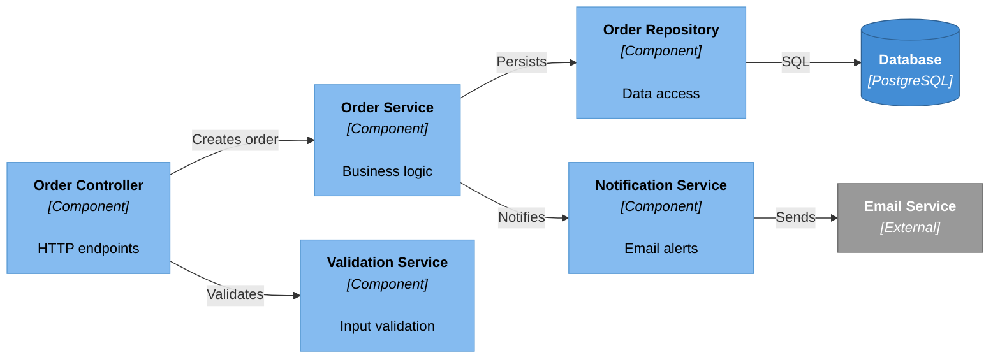

# Example: C4 Component Diagram

A C4 Component diagram (Level 3) zooms into a single container to show its **internal components** — controllers, services, repositories — and their dependencies. It answers: "How is this container structured internally?"

## The Prompt

```
/c4-diagram OrderService component flowchart

Container: Order Service

Components (inside the container):
- Order Controller: HTTP endpoints (entry point)
- Validation Service: Input validation
- Order Service: Business logic
- Notification Service: Email alerts
- Order Repository: Data access

External dependencies:
- Database (PostgreSQL): Stores order data
- Email Service: Sends email notifications

Requirements:
- Use flowchart LR with C4 component styling
- Components in light blue (#85BBF0)
- Databases in medium blue (#438DD5)
- External systems in grey (#999999)
- Maximum 0 edge crossings
- Declare elements in architectural layer order
```

## The Result




## What Makes This Good

### Colour Differentiation
Component diagrams use a **lighter blue** (`#85BBF0`) than container diagrams (`#438DD5`). This visual distinction helps readers immediately recognise which C4 level they are looking at.

### Layer-Based Declaration Order
Components follow their architectural layers:
1. **Entry point** (Controller) — leftmost, receives external requests
2. **Service layer** (OrderSvc, ValidationSvc, NotifySvc) — middle, business logic
3. **Repository layer** (OrderRepo) — data access abstraction
4. **External** (Database, Email) — rightmost, outside the component boundary

### Single Abstraction Level
This diagram shows *components within a container* — not database tables, not API endpoints, not class methods. Mixing abstraction levels (e.g., showing SQL queries alongside service names) is one of the most common C4 mistakes.

### Relationship Verbs
Each connection uses an action verb that describes what happens:
- "Validates" (not "connects to")
- "Persists" (not "uses")
- "SQL" (the specific protocol)

## When to Use Component Diagrams

Component diagrams are the most detailed C4 level that most teams need. Use them when:

- **Onboarding developers** to a specific service's internal structure
- **Reviewing architecture** of a complex container
- **Planning refactoring** to identify coupling between components

Avoid them when:
- The container is simple (< 4 components) — a Container diagram suffices
- You need code-level detail — use a class diagram or sequence diagram instead

## Tips for Clean Component Diagrams

- **Limit to 8-10 components** — split into sub-diagrams if larger
- **Show only key dependencies** — not every function call, just the major flows
- **Use repository pattern** — separate data access from business logic in the diagram
- **Entry points on the left** — controllers, handlers, listeners should be leftmost
- **External dependencies on the right** — databases, APIs, message queues

---

**Related skills:**
- [`/c4-diagram`](../../skills/diagramming/c4-diagram.md) — generates C4 diagrams at all levels
- [`/diagram-review`](../../skills/diagramming/diagram-review.md) — analyses existing diagrams for readability
