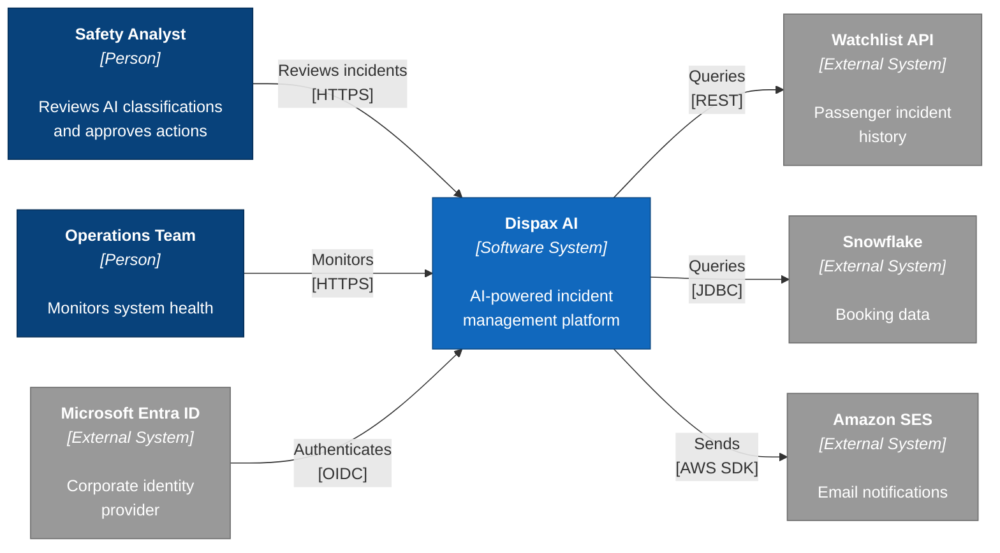
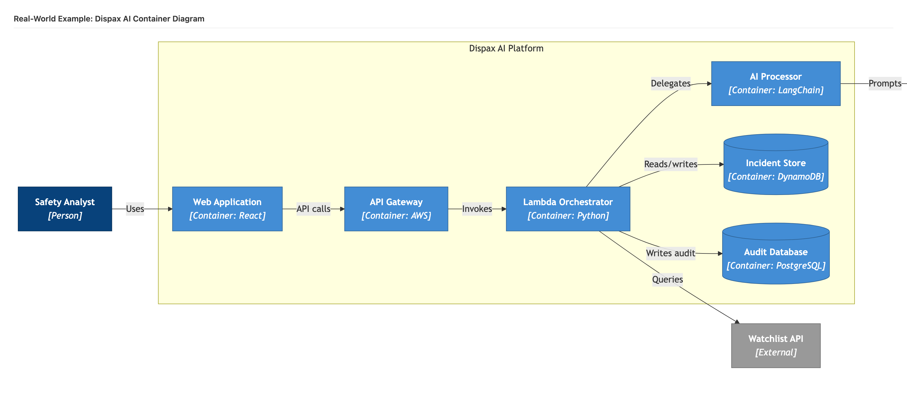

# Example: Real-World System (Context + Container)

This example shows a complete real-world system diagrammed at two C4 levels — Context (Level 1) and Container (Level 2). The system is an AI-powered incident management platform.

## Context Diagram (Level 1)

### The Prompt

```
/c4-diagram DispaxAI context flowchart

System: Dispax AI
Description: AI-powered incident management platform

Actors:
- Safety Analyst: Reviews AI classifications and approves actions
- Operations Team: Monitors system health

External systems:
- Microsoft Entra ID: Corporate identity provider (incoming, OIDC)
- Watchlist API: Passenger incident history (outgoing, REST)
- Snowflake: Booking data (outgoing, JDBC)
- Amazon SES: Email notifications (outgoing, AWS SDK)

Requirements:
- Use flowchart LR with C4 styling
- Maximum 0 edge crossings
```

### The Result




### Why This Works

- **8 elements** — within the recommended maximum of 10
- **Two actors** on the left, system in the middle, four external systems on the right
- **Mixed relationship directions** — Entra authenticates *into* the system (incoming), while the system queries *out* to Watchlist, Snowflake, and SES (outgoing)
- **Protocol labels** show the technology: HTTPS, OIDC, REST, JDBC, AWS SDK
- **Zero crossings** despite 6 relationships

---

## Container Diagram (Level 2)

### The Prompt

```
/c4-diagram DispaxAI container flowchart

System: Dispax AI Platform

Actor:
- Safety Analyst: Uses the system

Containers (inside the system boundary):
- Web Application (React): User interface
- API Gateway (AWS): Request routing
- Lambda Orchestrator (Python): Workflow coordination
- AI Processor (LangChain): Classification engine
- Incident Store (DynamoDB): Incident data
- Audit Database (PostgreSQL): Audit trail

External systems:
- AWS Bedrock: LLM inference (outgoing)
- Watchlist API: Passenger history (outgoing)

Requirements:
- Use flowchart LR with C4 styling
- Group containers in a subgraph boundary
- Maximum 0 edge crossings
```

### The Result




### Why This Works

- **9 elements** — within the recommended maximum of 10
- **System boundary** (subgraph) clearly separates internal containers from external dependencies
- **Main flow** reads left-to-right: Analyst → Web → API → Orchestrator → AI Processor → Bedrock
- **Branch relationships** — Orchestrator also writes to DynamoDB, RDS, and queries Watchlist
- **Database shapes** — DynamoDB and PostgreSQL use cylinder notation `[("...")]`
- **Technology labels** — each container shows its implementation technology

## Lessons from Real-World Diagrams

### Handling Mixed Technologies
This system uses React, AWS services, Python, LangChain, DynamoDB, and PostgreSQL. The C4 model handles this gracefully — each container declares its technology in the label, letting readers quickly assess the tech stack.

### AI + Traditional Components
The AI Processor is just another container. It connects to AWS Bedrock (an external LLM service) exactly like any other external dependency. Do not treat AI components as special — they follow the same C4 patterns.

### Multiple Data Stores
Systems often have multiple databases for different purposes (transactional data vs. audit trail). Show each as a separate container with its specific purpose, not a generic "Database" label.

### Branching from a Central Service
The Lambda Orchestrator connects to 4 different targets. When one service has many outgoing relationships, position it centrally and let relationships fan out. The tier-based declaration order naturally achieves this.

---

**Related skills:**
- [`/c4-diagram`](../../skills/diagramming/c4-diagram.md) — generates both Context and Container levels
- [`/diagram-review`](../../skills/diagramming/diagram-review.md) — analyses existing diagrams for readability
