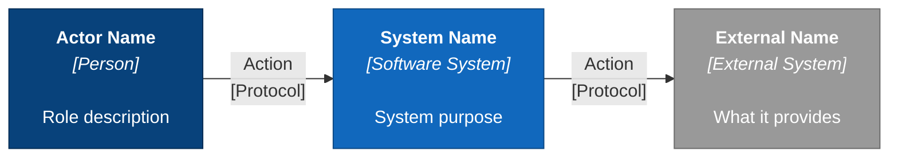
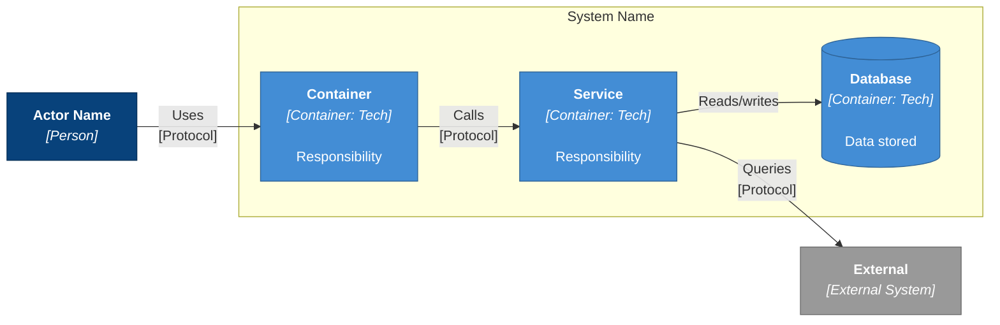

# /c4-diagram Skill

Generate C4 architecture diagrams (Mermaid, flowchart, or PlantUML) from System note frontmatter data.

## When to Use This Skill

Use `/c4-diagram` when you need to generate C4 architecture diagrams from the structured `c4:` data stored in System note frontmatter. Supports three output formats: native Mermaid C4 (default), `flowchart LR` with C4 styling (more layout control), and PlantUML with directional hints (best for complex diagrams). This complements the `/diagram` skill (which generates Python `diagrams` PNGs) by producing text-based diagrams that are Git-friendly and render inline in Obsidian.

## Usage

```
/c4-diagram <system-name> [level] [format]
```

### Arguments

| Argument      | Required | Description                                               |
| ------------- | -------- | --------------------------------------------------------- |
| `system-name` | Yes      | Name of the System note (e.g., `ODIE`, `AMOS`, `SAP BTP`) |
| `level`       | No       | `context` (L1, default), `container` (L2), or `both`      |
| `format`      | No       | `mermaid` (default), `flowchart`, or `plantuml`            |

### Format Options

| Format       | Syntax Used                        | Best For                                           |
| ------------ | ---------------------------------- | -------------------------------------------------- |
| `mermaid`    | C4Context/C4Container native       | Clean Obsidian rendering, ≤10 elements (default)    |
| `flowchart`  | `flowchart LR` with classDef C4   | More layout control via declaration order           |
| `plantuml`   | C4-PlantUML with directional hints | >15 elements, persistent crossings, formal docs     |

**When to choose each format:**

| Scenario                              | Choose         | Reason                                              |
| ------------------------------------- | -------------- | --------------------------------------------------- |
| Quick inline diagram in Obsidian      | `mermaid`      | Native rendering, fast iteration                    |
| Need layout control, <15 elements     | `flowchart`    | Declaration order gives more influence over Dagre    |
| Complex layouts with persistent crossings | `plantuml` | Directional hints (`Rel_Down`, `Lay_Right`) fix crossings |
| >15 elements                          | `plantuml`     | Layout control prevents chaos at scale              |
| Formal documentation, PDF export      | `plantuml`     | Better export quality, automatic legend             |
| CI/CD or Structurizr pipeline         | `plantuml`     | Stable server-side rendering                        |

### Examples

```
/c4-diagram ODIE
/c4-diagram AMOS container
/c4-diagram SAP BTP both
/c4-diagram ODIE container flowchart
/c4-diagram AMOS both plantuml
```

## Instructions

### Phase 1: Read System Data

1. Find the System note matching the name argument:
   - Search for `System - <name>.md` in the vault root
   - If not found, try graph query: `node scripts/graph-query.js --search "<name>" --type System`

2. Read the note and extract the `c4:` frontmatter section. Required fields:
   - `c4.actors` - People/roles (for Context diagram)
   - `c4.containers` - Internal services (for Container diagram)
   - `c4.externalRelationships` - External system connections
   - `c4.internalRelationships` - Container-to-container connections
   - `c4.description` - System description
   - `c4.boundary` - Whether system is internal or external

3. If `c4:` data is missing or empty, inform the user:
   > This system note has no `c4:` data. Add C4 architecture data to the frontmatter first. See the System template for the schema.

### Phase 2: Generate Mermaid C4

Generate the Mermaid code following these **best practices**:

#### General Rules

- **Maximum 10 elements** per diagram (actors + systems + containers)
- **Descriptions under 40 characters** - truncate if needed
- **Use directional relationships** - `Rel_D` (down) for primary flow, `Rel_R` (right) for secondary
- **Order**: Persons → System Boundary → External Systems → Relationships → Config
- **Always include** `UpdateLayoutConfig($c4ShapeInRow="3", $c4BoundaryInRow="1")` at the end
- **Alias naming**: Use camelCase without spaces (e.g., `dataEngineer`, `sapS4hana`)
- **Strip wiki-link syntax** from target names (e.g., `[[System - ODIE]]` → `ODIE`)

#### Layout Science

Declaration order is the most important factor for readable diagrams. The Dagre/Sugiyama layout algorithm positions elements based on where they appear in the code — declare elements in your intended reading order.

**Tier-based ordering** — declare elements in this order:

1. **Actors** (leftmost / topmost)
2. **Presentation layer** (web apps, UIs)
3. **API layer** (gateways, routers)
4. **Service layer** (business logic)
5. **Data layer** (databases, caches)
6. **External systems** (rightmost / bottommost)

**Edge crossing targets:**

| Diagram complexity | Target crossings |
| ------------------ | ---------------- |
| Simple (≤6 elements) | 0              |
| Medium (7–12 elements) | <3            |
| Complex (>12 elements) | <5            |

**Gestalt proximity** — use subgraphs/boundaries to group related elements. Elements placed close together are perceived as related (this overrides colour or shape similarity).

> For full graph drawing theory (Sugiyama algorithm stages, barycentric method, Purchase et al. research), see `.claude/prompts/c4-mermaid-diagrams.md`.

#### Prompt Antipatterns

Avoid these when structuring the diagram code:

| Antipattern                     | Why It Fails                            | Fix                                    |
| ------------------------------- | --------------------------------------- | -------------------------------------- |
| **Random element order**        | Algorithm starts from poor position     | Match declaration order to data flow   |
| **Relationships before elements** | Layout has no starting positions      | Declare ALL elements before ANY relationships |
| **Mixed abstraction levels**    | Database tables on a container diagram  | One abstraction level per diagram      |
| **No crossing target**          | Accepts any layout                      | Set explicit crossing limit            |
| **Vague "make it cleaner"**     | AI cannot act on vague instructions     | Specify which crossings to reduce      |

#### C4 Context Diagram (Level 1)

Generate a `C4Context` diagram:

```mermaid
C4Context
    title <System Name> - System Context

    %% Actors (from c4.actors)
    Person(<alias>, "<name>", "<description>")

    %% The system itself
    System(<sysAlias>, "<System Name>", "<c4.description>")

    %% External systems (from c4.externalRelationships targets)
    System_Ext(<alias>, "<target name>", "<brief description>")

    %% Relationships
    %% Actor → System (from c4.actors[].relationship)
    Rel_D(<actorAlias>, <sysAlias>, "<relationship>", "")

    %% System → External (from c4.externalRelationships)
    %% Use direction based on relationship.direction:
    %%   outgoing → Rel_D(system, ext, ...)
    %%   incoming → Rel_D(ext, system, ...)
    %%   bidirectional → Rel(system, ext, ...) (no direction suffix)
    Rel_D(<sysAlias>, <extAlias>, "<description>", "<technology>")

    UpdateLayoutConfig($c4ShapeInRow="3", $c4BoundaryInRow="1")
```

#### C4 Container Diagram (Level 2)

Generate a `C4Container` diagram:

```mermaid
C4Container
    title <System Name> - Container Diagram

    %% Key actors (pick top 2-3 from c4.actors)
    Person(<alias>, "<name>", "<description>")

    %% System boundary with containers
    System_Boundary(<boundaryAlias>, "<System Name>") {
        %% From c4.containers
        %% Use Container for services, ContainerDb for databases
        Container(<alias>, "<name>", "<technology>", "<description>")
        ContainerDb(<alias>, "<name>", "<technology>", "<description>")
    }

    %% External systems (from c4.externalRelationships)
    System_Ext(<alias>, "<target name>", "<brief description>")

    %% Actor → Container relationships
    Rel_D(<actorAlias>, <containerAlias>, "<action>", "<protocol>")

    %% Internal relationships (from c4.internalRelationships)
    Rel(<sourceAlias>, <targetAlias>, "<description>", "<technology>")

    %% External relationships (from c4.externalRelationships)
    %% Connect to the specific container that owns the relationship
    %% If unclear, connect to the Integration Layer or main container
    Rel_D(<containerAlias>, <extAlias>, "<description>", "<technology>")

    UpdateLayoutConfig($c4ShapeInRow="3", $c4BoundaryInRow="1")
```

#### Flowchart Context Diagram (format: `flowchart`)

When using `flowchart` format, generate a `flowchart LR` diagram with C4 styling:



#### Flowchart Container Diagram (format: `flowchart`)



> For Component diagram flowchart template, see `.claude/prompts/c4-mermaid-diagrams.md`.

#### PlantUML Context Diagram (format: `plantuml`)

When using `plantuml` format, generate C4-PlantUML with directional hints:

```plantuml
@startuml
!include https://raw.githubusercontent.com/plantuml-stdlib/C4-PlantUML/master/C4_Context.puml

LAYOUT_LEFT_RIGHT()
LAYOUT_WITH_LEGEND()

title System Context Diagram for <System Name>

Person(actor1, "Actor Name", "Role description")

System(system, "System Name", "System purpose")

System_Ext(external1, "External Name", "What it provides")

Rel_Right(actor1, system, "Action", "Protocol")
Rel_Right(system, external1, "Action", "Protocol")

@enduml
```

#### PlantUML Container Diagram (format: `plantuml`)

```plantuml
@startuml
!include https://raw.githubusercontent.com/plantuml-stdlib/C4-PlantUML/master/C4_Container.puml

LAYOUT_TOP_DOWN()
LAYOUT_WITH_LEGEND()

title Container Diagram for <System Name>

Person(actor1, "Actor Name", "Role description")

System_Boundary(boundary, "System Name") {
    Container(container1, "Container", "Technology", "Responsibility")
    Container(container2, "Service", "Technology", "Responsibility")
    ContainerDb(database1, "Database", "Technology", "Data stored")
}

System_Ext(external1, "External Name", "What it provides")

' Tier 1 → Tier 2 (use Rel_Down for vertical hierarchy)
Rel_Down(actor1, container1, "Uses", "Protocol")
Rel_Down(container1, container2, "Calls", "Protocol")

' Tier 2 → Tier 3
Rel_Down(container2, database1, "Reads/writes", "SQL")

' Horizontal to external (use Rel_Right to prevent crossings)
Rel_Right(container2, external1, "Queries", "Protocol")

' Force horizontal alignment within a tier
Lay_Right(container1, container2)

@enduml
```

**PlantUML directional hint reference:**

| Hint                  | Effect              | Use For                                |
| --------------------- | ------------------- | -------------------------------------- |
| `Rel_Down(a, b, ...)`  | a above b           | Hierarchical tiers (API → Services)    |
| `Rel_Right(a, b, ...)` | a left of b         | Horizontal flow, external systems      |
| `Rel_Up(a, b, ...)`    | a below b           | Callbacks, responses                   |
| `Rel_Left(a, b, ...)`  | a right of b        | Reverse horizontal flow                |
| `Lay_Right(a, b)`      | Force a left of b   | Align elements horizontally in a tier  |
| `Lay_Down(a, b)`       | Force a above b     | Align elements vertically              |
| `Rel_Neighbor(a, b, ...)` | Force adjacent   | Tightly coupled elements               |

#### Deciding Container vs ContainerDb

- If `technology` contains: `oracle`, `postgres`, `mysql`, `dynamodb`, `redis`, `mongodb`, `snowflake`, `s3` → use `ContainerDb`
- Otherwise → use `Container`

#### Handling Large Systems (>10 elements)

If the system has more than 10 elements total:

1. **Context diagram**: Group related external systems. Show the top 6-8 most critical relationships.
2. **Container diagram**: Show top 6-8 containers. Add a note listing omitted containers.

### Phase 2.5: Validation Checklist

After generating the diagram code, validate against these criteria before presenting to the user:

| Criterion                     | Target                           | How to Check                             |
| ----------------------------- | -------------------------------- | ---------------------------------------- |
| **Edge crossings**            | <5 for complex, 0 for simple     | Trace each relationship path visually    |
| **Visual hierarchy**          | System boundary most prominent   | Is the boundary immediately identifiable? |
| **Grouping**                  | Related elements close together  | Do tiers/layers appear as distinct groups? |
| **Flow direction**            | Consistent L→R or T→B            | Does data flow follow one direction?     |
| **Relationship traceability** | Can follow each line             | Trace each connection without confusion  |
| **Abstraction level**         | One level per diagram            | No database tables on container diagrams |

If any criterion fails, apply fixes from Phase 2.6 before outputting.

### Phase 2.6: Iterative Refinement

If the validation checklist reveals issues (especially edge crossings):

**For Mermaid/Flowchart format:**

1. **Identify the crossing** — which two relationships intersect?
2. **Reorder declarations** — swap elements within the same tier so declaration order matches data flow
3. **Reorder relationships** — declare relationships in the same sequence as element declarations
4. **Add subgraphs** — group related elements to constrain their positions

**For PlantUML format:**

1. **Change `Rel` to `Rel_Right`/`Rel_Down`** — force specific edge directions
2. **Add `Lay_Right`/`Lay_Down`** — force element positioning within a tier
3. **Add invisible relationships** — e.g., `Lay_Right(db, payment)` to push elements apart

**Refinement prompt patterns that work:**

- "Swap declaration order of A and B to align with left-to-right flow"
- "Move X adjacent to Y using `Lay_Right`"
- "Change `Rel()` to `Rel_Right()` for the Orders→Payment relationship to prevent crossing with Inventory→Database"

> See `[[Reference - C4 Diagrams with AI]]` Part III and Part VII for detailed refinement examples.

### Phase 3: Output

1. **Display the generated Mermaid** in the response for the user to copy
2. **Ask the user** where to place the diagram:
   - Update the System note's existing C4 diagram sections (replace template placeholders)
   - Create a standalone Concept note: `Concept - C4 Diagrams - <System Name>.md`
   - Just display (don't save)

3. If saving to the System note, replace the placeholder Mermaid blocks in the "## C4 Architecture Diagrams" section.

4. If creating a standalone Concept note, use this structure:

```markdown
---
type: Concept
title: "C4 Diagrams - <System Name>"
created: <today>
modified: <today>
confidence: high
freshness: current
source: synthesis
verified: false
reviewed: <today>
tags:
  [
    activity/architecture,
    type/diagram,
    domain/<relevant>,
    technology/<relevant>,
  ]
---

# C4 Diagrams - <System Name>

> Auto-generated from `c4:` frontmatter on [[System - <Name>]]. Regenerate with `/c4-diagram <name> both`.

## Context Diagram (Level 1)

<mermaid block>

## Container Diagram (Level 2)

<mermaid block>

---

**Generated:** <today>
**Source:** [[System - <Name>]]
**Skill:** `/c4-diagram`
```

## Mermaid C4 Reference

### Element Types

| Element         | Syntax                                       | Use For                |
| --------------- | -------------------------------------------- | ---------------------- |
| Person          | `Person(alias, "Name", "Desc")`              | Human actors           |
| System          | `System(alias, "Name", "Desc")`              | This system (internal) |
| System_Ext      | `System_Ext(alias, "Name", "Desc")`          | External systems       |
| Container       | `Container(alias, "Name", "Tech", "Desc")`   | Services, apps         |
| ContainerDb     | `ContainerDb(alias, "Name", "Tech", "Desc")` | Databases, stores      |
| System_Boundary | `System_Boundary(alias, "Name") { ... }`     | Group containers       |

### Relationship Types

| Relationship | Syntax                             | Use For                      |
| ------------ | ---------------------------------- | ---------------------------- |
| Rel          | `Rel(from, to, "Label", "Tech")`   | No direction preference      |
| Rel_D        | `Rel_D(from, to, "Label", "Tech")` | Top-to-bottom (primary flow) |
| Rel_R        | `Rel_R(from, to, "Label", "Tech")` | Left-to-right (secondary)    |
| Rel_L        | `Rel_L(from, to, "Label", "Tech")` | Right-to-left                |
| Rel_U        | `Rel_U(from, to, "Label", "Tech")` | Bottom-to-top                |

### Layout Configuration

Always end with:

```
UpdateLayoutConfig($c4ShapeInRow="3", $c4BoundaryInRow="1")
```

Adjust `$c4ShapeInRow` based on element count:

- 1-6 elements: `"3"`
- 7-10 elements: `"4"`
- 10+ elements: `"5"` (but prefer splitting the diagram)

## Relationship to Other Skills

| Skill              | Difference                                                               |
| ------------------ | ------------------------------------------------------------------------ |
| `/diagram`         | Generates Python `diagrams` PNGs (better for presentations, cloud icons) |
| `/c4-diagram`      | Generates C4 diagrams in Mermaid, flowchart, or PlantUML format          |
| `/diagram-review`  | Analyses existing diagrams for readability and architecture quality       |

Use `/c4-diagram` for documentation that lives in the vault. Use `/diagram` for standalone images for presentations or Confluence.

## Further Reading

- **`.claude/prompts/c4-mermaid-diagrams.md`** — Full graph drawing theory (Sugiyama algorithm stages, barycentric method, Purchase et al. research), C4 colour standards, and worked examples
- **`[[Reference - C4 Diagrams with AI]]`** — Research-backed guide with prompt engineering patterns, iterative refinement examples, and PlantUML vs Mermaid comparison

## Troubleshooting

| Issue                  | Solution                                                     |
| ---------------------- | ------------------------------------------------------------ |
| Diagram doesn't render | Check Mermaid syntax - no special characters in descriptions |
| Too cluttered          | Reduce to 8 elements, use `$c4ShapeInRow="4"`                |
| Relationships overlap  | Use `Rel_R` and `Rel_L` to spread horizontally               |
| Missing data           | Add `c4:` frontmatter to the System note first               |

---

**Invoke with:** `/c4-diagram <system-name> [context|container|both] [mermaid|flowchart|plantuml]`

**Example:** `/c4-diagram ODIE both` → Generates C4 Context and Container diagrams from ODIE's frontmatter

**Example:** `/c4-diagram AMOS container plantuml` → Generates PlantUML Container diagram with directional hints
