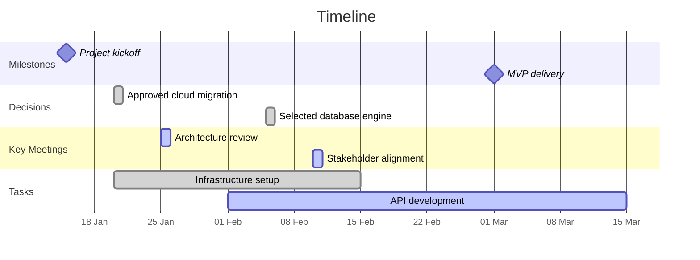

# /timeline

Generate visual timelines from vault content, showing meetings, decisions, milestones, and key dates in chronological order. Produces Mermaid Gantt charts or timeline lists from vault data.

## When to Use This Skill

- Visualising project history and milestones
- Creating timeline views for governance presentations
- Understanding the sequence of decisions and events
- Mapping the chronology of a topic or project
- Preparing historical context for new team members

## Usage

```
/timeline <scope> [--period YYYY-MM-DD:YYYY-MM-DD] [--format mermaid|list|table] [--events meetings,decisions,tasks,milestones]
```

### Parameters

| Parameter   | Description                                           | Required |
|-------------|-------------------------------------------------------|----------|
| `scope`     | Project name, topic, or search term                   | Yes      |
| `--period`  | Date range (default: auto-detect from content)        | No       |
| `--format`  | Output format (default: `mermaid`)                    | No       |
| `--events`  | Event types to include (default: all)                 | No       |

## Instructions

### Phase 1: Gather Timeline Data

1. **Search for content** matching the scope:
   - Project notes and linked content
   - Meeting notes with matching dates
   - ADRs and decisions
   - Tasks with due dates
   - Milestones mentioned in project files
2. **Extract dated events:**
   - Event title
   - Date (start date, end date if applicable)
   - Event type (meeting, decision, milestone, task, deadline)
   - Significance (critical, important, normal)
   - Related notes

### Phase 2: Build Timeline

1. **Sort events chronologically**
2. **Group by phase** or month (for long timelines)
3. **Identify key moments** — Decisions, milestones, and turning points
4. **Generate diagram** in the requested format

### Phase 3: Output

Generate the timeline in the requested format and present to the user.

## Output Format

### Mermaid Gantt Format



### Table Format

```markdown
# Timeline: <Scope>

**Period:** <start> to <end> | **Events:** X

| Date       | Event Type | Event                           | Significance | Notes              |
|------------|------------|---------------------------------|--------------|--------------------|
| YYYY-MM-DD | Milestone  | Project kickoff                 | Critical     | [[Project - ...]]  |
| YYYY-MM-DD | Decision   | Approved cloud approach         | Important    | [[ADR - ...]]      |
| YYYY-MM-DD | Meeting    | Architecture review             | Normal       | [[Meeting - ...]]  |
```

### List Format

```markdown
# Timeline: <Scope>

## 2026 January

### 15 Jan — **Project Kickoff** 🏁
[[Project - Name]] kicked off with initial scope definition.

### 20 Jan — **Decision: Cloud Migration Approved** ✅
[[ADR - Cloud Migration]] accepted. Key factors: cost, scalability.

### 25 Jan — Architecture Review
[[Meeting - 2026-01-25 Architecture Review]] — Reviewed integration patterns.

## 2026 February

### 05 Feb — **Decision: Database Selection** ✅
[[ADR - Database Selection]] — PostgreSQL selected over MySQL.
```

## Examples

### Example 1: Project Timeline

```
/timeline "Order Migration" --format mermaid
```

Generates a Mermaid Gantt chart of all events related to the Order Migration project.

### Example 2: Decision Timeline

```
/timeline "Cloud Architecture" --events decisions --format list
```

Lists all architecture decisions related to cloud in chronological order.

### Example 3: Custom Period

```
/timeline "Platform Team" --period 2026-01-01:2026-03-31 --format table
```

Table of all events related to the Platform Team in Q1 2026.

---

**Invoke with:** `/timeline <scope>` to generate visual timelines from vault events
